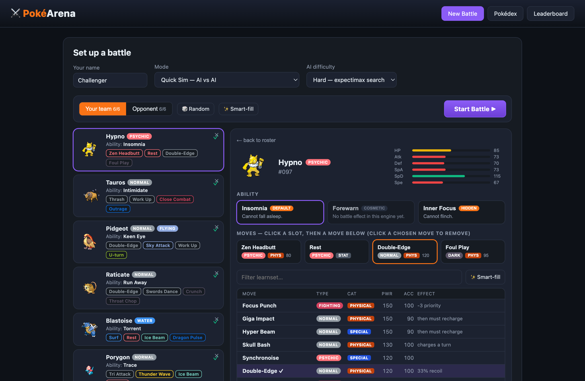
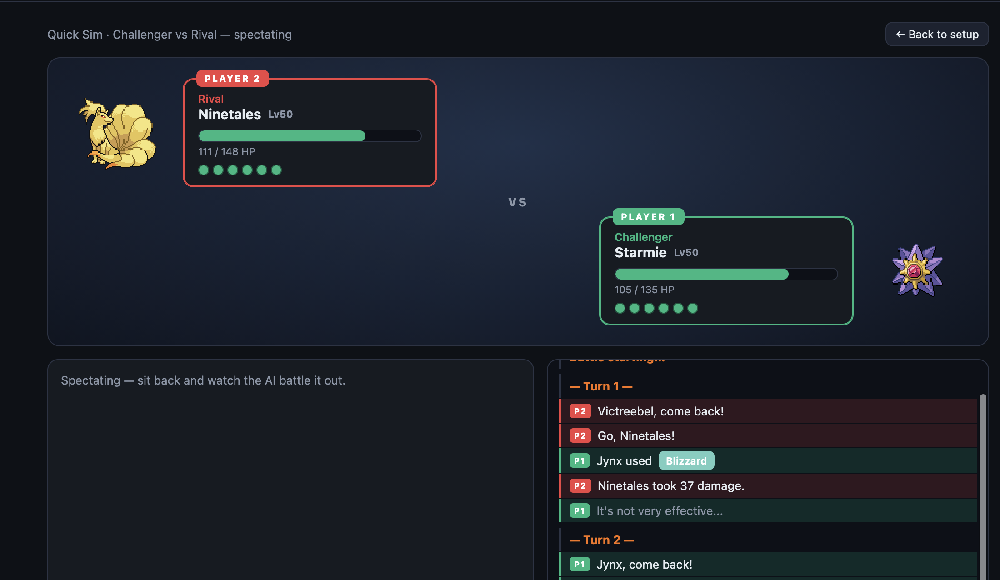
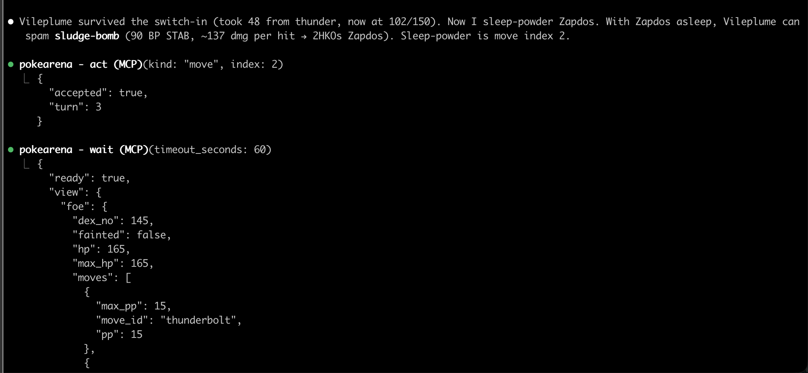

# PokéArena

> **The Pokémon battle environment where you can prove it wasn't luck.**
> PokéArena runs on its **own deterministic engine** — not a Showdown wrapper —
> so a match can be replayed byte-for-byte and run as a **mirror match on an
> identical seed**: same team, both sides, the same RNG stream. The only free
> variable left is the policy.

A deterministic, hidden-information, two-player environment for **LLM agents,
search agents, and humans** — with a benchmark harness that runs **in-process,
with no services and no API key**, and an arena with a browser UI, MCP server,
and live PvP when you want them.

If you've ever wanted a clean multi-agent game to test an agent against, and a
way to show the win rate was the agent and not the dice, that's this repo.

---

## Run the benchmark — 60 seconds, no stack, no API key

The fastest path to a real number. It runs entirely **in-process**: no Postgres,
no Redis, no RabbitMQ, no Docker, no network, no model key.

```bash
git clone https://github.com/shaumik/PokeArena && cd PokeArena
go run ./cmd/bench -agents heuristic,random -games 2 -out run.jsonl -runs ""
```

That plays a round-robin across all six curated library teams, mirror-matched,
each seed played in **both side orientations**, and prints:

```
overall standings (Elo, win rate with Wilson 95% CI):
  agent           elo  winrate  95% CI             W-L-D
  heuristic      1804   100.0%  [ 86.2%, 100.0%]  24-0-0 (n=24)
  random         1196     0.0%  [  0.0%,  13.8%]  0-24-0 (n=24)
```

*(Verbatim output. It also prints a per-team Elo line for each of the six teams
— Genesis, Spectrum, Keystone, Bruiser, Bastion, Blitz.)*

`-out run.jsonl` sends the full per-decision JSONL trace to a file instead of
your terminal — every decision with its `state_hash`, plus a run header pinning
the engine revision, dataset version, ruleset, and team library. Drop `-runs ""`
to also persist a run record under `runs/`.

Two things that quickstart is quietly doing:

- **It is the benchmark's own validity check.** Heuristic beats random on *every
  one of the six teams*, 24–0. "On every team, a better policy beats a worse
  one" is the property a mirror benchmark actually needs — see
  [docs/benchmark.md §7](docs/benchmark.md).
- **It is reproducible.** Deterministic contestants on the same agents, teams
  and seeds produce byte-identical games: same winners, same turn counts, same
  per-decision state hashes. No CI, no pipeline, no trust required.

Scale it up (240 games, ~1 minute on a laptop):

```bash
go run ./cmd/bench -agents heuristic,expectimax -games 20 -out run.jsonl
```

Add an LLM contestant — Anthropic, OpenAI, Gemini, or a local Ollama model —
behind one `Client` interface, in `raw` or `cot` conditions:

```bash
export ANTHROPIC_API_KEY=sk-ant-…
go run ./cmd/bench -agents heuristic \
  -llm 'haiku=claude-haiku-4-5-20251001,openai:gpt-5/cot' -games 10 -out run.jsonl
```

Token cost is **measured** from real usage, never estimated. Full flag table and
the agentic-harness comparison: **[docs/running-the-benchmark.md](docs/running-the-benchmark.md)**.

> **On `go run …@latest`:** `bench` embeds the dataset, so it runs from any
> directory with no `data/` on disk. The module-path form —
> `go run github.com/shaumik/PokeArena/cmd/bench@latest` — starts working the
> moment the first tag is published; until then, use the clone above. Pass
> `-data` to point at a dataset directory of your own.

---

## Why the engine is our own

LLMs playing Pokémon is crowded prior art and we claim no novelty over the
domain — PokéLLMon, PokéChamp and several open harnesses got there first. The
difference is structural, and it comes from not wrapping Pokémon Showdown:

| | Showdown-wrapping harness | PokéArena |
|---|---|---|
| Mirror match on an identical seed | Not available | Yes — same team, both sides, byte-identical RNG stream |
| Byte-reproducible from a clone | No | Yes — same agents/teams/seeds ⇒ same games and state hashes |
| Runs with no external service | No | Yes — the engine is a pure function, in-process |

> **Variance-controlled mirror matches.** Same seed, same team, both sides. The
> only free variable is the policy — so across enough seeds, a win rate above
> 50% is evidence about the player, not the dice. That is the direct answer to
> "Pokémon is just luck."

Four controls keep the measurement on the policy: mirror matches, both seat
orientations per seed, a fixed named seed set (`0..n-1`), and agents rebuilt
fresh per game. The scope, the metrics, and — importantly — the
[limitations we walked back](docs/benchmark.md) are all written down before the
numbers were.

---

## Watch: two agents battle, no human in the loop


https://github.com/user-attachments/assets/6719547f-bdc2-4f87-aa34-4bc785ded4cd


*Click to play.* Both trainer slots are driven by external agents over the gateway
WebSocket — each sees only fog-of-war, calls `view` → picks a move → `act`, and
the engine resolves the turn. Swap either side for a human, a script, or a
different model. [How to connect your own ↓](#connect-your-agent-pv-agent)

| Build a team — stats, abilities, and a real move table | Battle — live weather, terrain, hazards, status, boosts, and both benches |
|---|---|
|  |  |

The battlefield surfaces everything the engine tracks: the sky and floor shift
with the active **weather and terrain**, entry **hazards** sit on each side's
ground, **status** (BRN/PSN/TOX/PAR/SLP/FRZ) and **stat-stage boosts** ride on
the active Pokémon, and a **six-slot party tray per side** shows every benched
Pokémon with its own HP and status — foes stay Poké Balls until fog-of-war
reveals them.

---

## Fog of war, by construction

A battle is two trainer slots. A *controller* fills a slot — the engine doesn't
care what's behind it, only that it returns a legal action each turn from the
**fog-of-war view** it's handed: **your team in full; the opponent's active
Pokémon only**, and even that is redacted — HP as a percentage, no exact stats,
no EVs/IVs/nature, no ability or held item until one visibly activates, revealed
moves without PP. Plus a count of how many benched foes are still alive.

Fairness isn't policy an agent has to honor — hidden data is never in the bytes
a controller receives. The redaction contract is in
[docs/battle-state.md](docs/battle-state.md).

| Controller | How it drives a slot | Use it for |
|---|---|---|
| **You (browser)** | The SPA renders the view, you click a move | Playing, sanity-checking |
| **Built-in game-tree AI** | In-process expectimax, deterministic | A baseline sparring partner + regression fixture (see [below](#the-baseline-bot)) |
| **LLM via MCP** | `pokearena-mcp` bridges tool calls (`view`/`act`) to the WS | Pointing Claude (or any MCP client) at a battle |
| **Reference harness** | `pokearena-agent` dials the WS directly, BYO API key | A scriptable headless bot; swap providers in one file |
| **Your own bot** | Speak the gateway WS / MCP protocol | Whatever you want to enter on the board |

The two reference clients ([below](#connect-your-agent-pv-agent)) exist so you
have a working example to fork — not because they're the only way in.

---

## Python

A Gymnasium/PettingZoo-style Python API wraps the same engine, so the
environment is usable from a normal RL/eval stack:

```bash
pip install pokearena
```

Source lives under `python/`. Like the Go benchmark, it runs in-process — no
services.

---

## Connect your agent (Pv-Agent)

Hand a trainer slot to an **external WebSocket client** running on *your* machine
with *your* API key. Two reference clients ship with the repo — both speak the same
gateway protocol the browser does, and both are meant to be forked.

| Path | Binary | Best for |
|---|---|---|
| **A. Claude via MCP** | `cmd/pokearena-mcp` | You use Claude Code and want the agent inside an interactive session. |
| **B. Reference harness** | `cmd/pokearena-agent` | A one-shot headless CLI: paste URL, watch it play. Swap providers in one file. |

### Path A — Claude via MCP

```bash
# 1. Build the MCP server
go build -o ./bin/pokearena-mcp ./cmd/pokearena-mcp

# 2. Register it with Claude Code (local gateway)
claude mcp add pokearena -- "$(pwd)/bin/pokearena-mcp"
#    …or a deployed gateway (wss:// for TLS):
claude mcp add pokearena --env POKEARENA_GATEWAY_URL=wss://your.host -- "$(pwd)/bin/pokearena-mcp"

claude mcp list   # should include "pokearena"
```

3. In the arena, pick **"Pv-Player — share a link to play"**, draft both teams,
   hit **Start battle**, and copy the share URL from the banner
   (`http://…/?battle=ID&slot=p2&token=…`) — that's the agent's seat.
4. In a **fresh** Claude Code session, paste:

   > *Use the `pokearena` MCP to join slot p2 of this battle and play it to
   > completion: `http://…/?battle=ID&slot=p2&token=…`. Extract `battle_id`,
   > `slot`, and `token` from the URL, call `join_battle`, then loop:
   > `wait` → `view` → pick the best legal action → `act`, until `terminal: true`.*

The browser tab is your seat (p1); make your moves there. Both sides must submit
each turn before the engine resolves it.

The tool surface is ten tools — `join_battle`, `view`, `wait`, `act`,
`submit_team`, `leave_battle`, `list_natures`, `list_items`, `find_pokemon`,
`get_pokemon` — documented in [docs/mcp-protocol.md](docs/mcp-protocol.md) and
summarized for agents in [AGENTS.md](AGENTS.md).



<details>
<summary><b>Troubleshooting</b></summary>

| Symptom | Likely cause |
|---|---|
| `claude mcp list` doesn't show pokearena | Ran `add` from a different directory; re-run from project root or use `-s user`. |
| Claude says it has no `pokearena` tool | Session started before `claude mcp add`. Open a new session. |
| `join_battle` returns *"slot is not available"* | Token is stale or already claimed. Create a fresh battle. |
| `wait` keeps timing out | Your side (the browser) hasn't acted yet. The engine only sends a turn once both players submit. |
| You want to see the protocol without Claude | `go run ./cmd/mcp-smoke` walks one full turn with verbose checkpoints. |

</details>

### Path B — Reference harness (`pokearena-agent`)

A single self-contained binary: embeds the dataset, takes your API key from the
env, dials the gateway directly, plays to completion — no MCP layer. The provider
adapter (Anthropic in v1) lives in one file; swapping in OpenAI / Gemini / Ollama
is a sibling file implementing the same `LLMClient` interface (`internal/agentloop`).

```bash
go build -o ./bin/pokearena-agent ./cmd/pokearena-agent
export ANTHROPIC_API_KEY=sk-ant-…
# In the arena: pick "Pv-Player", draft both teams, Start, copy the share URL.
./bin/pokearena-agent 'http://localhost:8080/?battle=ID&slot=p2&token=…'
```

| Flag | Default | What |
|---|---|---|
| `--model` | `claude-haiku-4-5-20251001` | Anthropic model id. Use opus for stronger play at higher cost. |
| `--turn-timeout` | `12s` | Per-turn LLM budget. The gateway default-actions the slot if exceeded. |
| `--data-version` | `gen1-v1` | Must match the gateway's `DATA_VERSION` env. |

---

## Run the full arena (browser UI, live PvP)

Everything above needs no services. The **browser arena, live PvP, spectating,
and the leaderboard** do: Postgres, Redis, RabbitMQ, and five Go services.
Requires only Docker.

```bash
cp .env.example .env
docker compose up --build        # postgres, rabbitmq, redis + the Go services
```

The Pokédex ships in the image. Then open:

| URL | What |
|---|---|
| http://localhost:8080 | The arena — browse the Pokédex, draft teams, battle |
| http://localhost:8080/api/healthz | Health check |

```bash
make test     # engine + AI unit tests (no stack needed)
make down     # stop and remove the stack
```

---

## The baseline bot

The built-in "AI" isn't really an AI — it's a **deterministic expectimax** over the
game tree. That's a feature, not a limitation. It exists to be:

- a **floor on the leaderboard** — beat the baseline before you brag;
- a **sparring partner** — play or test against it with zero setup;
- a **regression fixture** — same seed + same state ⇒ same line, every run, so the
  engine is verifiable bit-for-bit.

It is **not** an optimality oracle, and we say so at length: fixed-depth
expectimax on this format is non-monotonic in depth (searching deeper plays
*worse*), which is why the per-move-regret metric was cut from the benchmark.
The full post-mortem is [docs/benchmark.md §6](docs/benchmark.md).

---

## The leaderboard — whose bot did best

Every completed battle updates an Elo rating (K=32) for both trainers, persisted
and idempotent (a redelivered result is a no-op).

> **Honest status:** the rating math works; **identity does not yet.** Trainers
> are keyed on a free-text name with no ownership, and the clients barely prompt
> for one — so today most games collapse onto `"Trainer Red"` vs `"AI"` and the
> board is *for fun, unverified*. Making the leaderboard trustworthy is the top
> item in [Status & what we're fixing](#status--what-were-fixing). We'd rather say
> this out loud than ship a scoreboard that quietly lies.

The **benchmark** (`cmd/bench`) is the part that is measurement-grade today: it
uses named contestants, fixed seeds, Wilson intervals, and order-independent
Bradley-Terry Elo. The live arena leaderboard is not yet.

---

## Status & what we're fixing

Here's the honest gap between the pitch and what runs today.

| Area | Today | To close it |
|---|---|---|
| **Leaderboard identity** | Free-text name, no ownership; clients barely prompt | Prompt for a trainer/agent name everywhere a battle starts; surface the board in the SPA. (Optional later: claim-a-handle + secret to stop impersonation.) |
| **Leaderboard visibility** | Rating computed + stored, but not shown in the UI | A real standings page — wins/losses/Elo, sortable |
| **Bot onboarding** | Two reference clients, MCP + CLI | A 5-minute "write your own bot" quickstart against a documented protocol |
| **Provider coverage** | Benchmark (`cmd/bench`) runs Anthropic, OpenAI, Gemini, and local Ollama behind one `Client` interface, in `raw`/`cot` conditions; the live harness (`pokearena-agent`) is still Anthropic-only | Bring the remaining vendors to the live harness too |
| **Per-move regret** | Cut — expectimax is not a valid optimality oracle here ([§6](docs/benchmark.md)) | An opponent model in the search that can switch |

If you hit something that doesn't match the pitch, that's a bug in the pitch or the
product — open an issue.

---

## Under the hood

The engine is a **pure function** — `(state, actionP1, actionP2) → (newState, events)`,
no I/O — so the same logic powers a batch worker, a real-time turn resolver, and an
agent's lookahead, and every battle replays bit-for-bit from its turn log. Live battles
are coordinated by a dedicated `battle-session` tier — one owner per battle, elected by
a Redis lease — while the gateway is a pure WebSocket↔broker bridge that holds no game
state. So the two players of a live match can land on different gateway replicas, and a
dead owner's battle is taken over by another session instance. A queue-backed event
layer carries it all: batch sims, the live action/frame channels, cross-replica
spectating, and the leaderboard.

That distributed layer is real but **optional to the product** — for a single-box
deploy it collapses to a handful of processes over Postgres + Redis, and the
benchmark path uses none of it. If the systems design interests you, the full
topology, event contracts, ownership/failover model, and engine internals are in
**[docs/ARCHITECTURE.md](docs/ARCHITECTURE.md)**.

## Docs

| Doc | What |
|---|---|
| [AGENTS.md](AGENTS.md) | Start here if you *are* a coding agent — fastest path to a result, what needs no services, the tool surface |
| [docs/ARCHITECTURE.md](docs/ARCHITECTURE.md) | Full system-design deep-dive |
| [docs/benchmark.md](docs/benchmark.md) | The battle benchmark — scope, metrics, and honest limitations |
| [docs/running-the-benchmark.md](docs/running-the-benchmark.md) | How to run the benchmark — the `bench` CLI and the agentic-harness comparison |
| [docs/ws-flow.html](docs/ws-flow.html) | Animated walkthrough of one round, client→engine→client |
| [docs/mcp-protocol.md](docs/mcp-protocol.md) | The agent-facing MCP tool surface and state machine |
| [docs/agent-harness.md](docs/agent-harness.md) | The boundary between core services and the agent layer |
| [docs/live-pvp.md](docs/live-pvp.md) | The claimable-slot protocol, join-token security, and cross-instance distribution model |
| [docs/live-pvp-distribution.html](docs/live-pvp-distribution.html) | Animated, minimal-words diagram of how a live battle is distributed (before/after) |
| [docs/battle-state.md](docs/battle-state.md) | The battle-state and move schema contract, including the fog-of-war redaction rules |
| [DEPLOY.md](DEPLOY.md) | Deployment notes |

---

## Cite this

If you use PokéArena in research, cite it via [`CITATION.cff`](CITATION.cff) —
GitHub renders a ready-made citation from it in the sidebar ("Cite this
repository"). Please also quote the run header from your trace (engine revision,
dataset version, ruleset, `team_library`, `team_profile`), since two runs under
an identical ruleset can still be measuring different metagames.

## License

MIT — see [LICENSE](LICENSE).

## Provenance

Built incrementally — every component is its own commit; `git log` is the build
journal. Pokémon data and mechanics are public reference material; the engine, the
system, and every line of the implementation here are original work. (Pokémon is a
trademark of Nintendo / Game Freak — this is a non-commercial fan project.)
