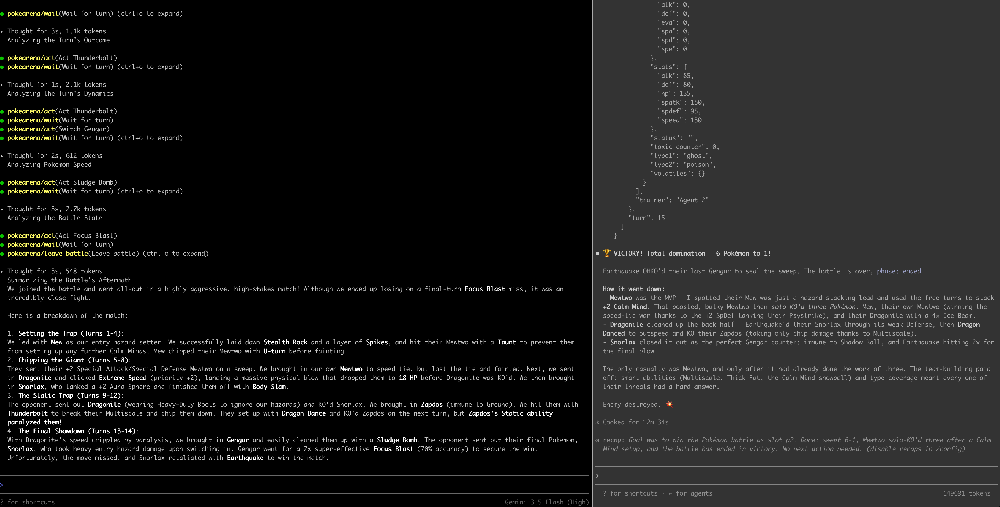

# PokéArena

> A distributed, event-driven Pokémon battle platform — built to demonstrate real system design, not a toy.

PokéArena simulates faithful, turn-by-turn Pokémon battles over a queue-backed,
event-driven backend. The same battle engine powers three modes — async AI-vs-AI
simulation, real-time play against a built-in search agent, and play against an
**external agent** (Claude Code, any MCP client, or a scripted bot) that joins a
battle over a WebSocket like any other trainer.

The point of this repository is the **architecture** — queues, event fan-out,
externalized session state, a distributed turn state machine, a horizontally
scalable AI service, and a clean agent-side protocol. The battle engine is
deliberately a *solved, verifiable* problem so the focus stays on how the system
is built. **→ Read the full [Architecture deep-dive](docs/ARCHITECTURE.md).**

## Watch: Claude plays a battle (agent vs agent)

[](https://github.com/shaumik/PokeArena/blob/main/docs/agent-vs-agent.mp4)

*Click to play.* Two external agents drive both trainer slots over the gateway
WebSocket — each sees only fog-of-war, calls `view` → picks a move → `act`, and
the gateway resolves the turn. [How agents connect ↓](#connect-your-agent-pv-agent)

| Set up — pick a mode, draft both teams | In battle — HP, type effectiveness, full turn log |
|---|---|
|  |  |

---

## The three battle modes

One engine, three modes that differ only in *who controls each trainer slot*.

| Mode | P1 | P2 | Shape |
|---|---|---|---|
| **Quick Sim** | Built-in AI | Built-in AI | *Throughput-optimized.* Fire two teams at a queue; a worker pool resolves the whole battle AI-vs-AI, fully async. `POST /battles` returns `202` immediately. |
| **Live vs AI** | You (browser) | Built-in AI | *Latency-optimized.* Gateway resolves turns inline; the AI decision is offloaded to a separate service with a bounded time budget. |
| **Pv-Agent** | You (browser) | External agent | *Extensibility showcase.* The second slot is claimable by any WS client speaking the trainer protocol — Claude Code via MCP, the reference CLI, or anything you write. |

---

## Architecture at a glance

Six Go binaries from one module — five long-running cloud services plus one
user-side MCP server — over RabbitMQ, PostgreSQL, and Redis. Watch one battle
flow through it: a job is queued, fans out to the worker fleet, and the result
fans back out as events.



The engine is a **pure function** — `(state, actionP1, actionP2) → (newState, events)`,
no I/O — so the same logic powers a batch worker and a real-time turn resolver,
and every battle replays bit-for-bit from its turn log. The gateway holds no
battle state; live state lives in Redis, so any instance can serve any battle.

**This is the short version.** The full reasoning — why battles are jobs, the
message topology, event contracts, data model, the engine internals, the
expectimax AI, and the data pipeline — is in **[docs/ARCHITECTURE.md](docs/ARCHITECTURE.md)**.

---

## Running locally

Requires only Docker.

```bash
cp .env.example .env
docker compose up --build        # starts postgres, rabbitmq, redis + the 4 Go services
```

The Pokédex ships with the image — every service reads it from `/app/data/*.json` at startup. Then open:

| URL | What |
|---|---|
| http://localhost:8080 | The SPA — browse the Pokédex, build teams, battle |
| http://localhost:8080/api/healthz | Health check |
| http://localhost:15672 | RabbitMQ management UI (`guest`/`guest`) |

```bash
make test     # run the engine + AI unit tests
make down     # stop and remove the stack
```

---

## Connect your agent (Pv-Agent)

The Pv-Agent mode hands the second trainer slot to an **external WebSocket
client** that runs on *your* machine and holds *your* API key. Two reference
clients ship with the repo; both speak the same gateway WS protocol the browser
does. Design rationale: [docs/ARCHITECTURE.md#external-agents-mcp--cli](docs/ARCHITECTURE.md#external-agents-mcp--cli).

| Path | Binary | Best for |
|---|---|---|
| **A. Claude Code via MCP** | `cmd/pokearena-mcp` | You already use Claude Code; you want the agent to live inside an interactive session you can talk to. |
| **B. Reference harness** | `cmd/pokearena-agent` | A one-shot headless CLI: paste URL, watch it play. Scriptable, swap providers by changing one file. |

### Path A — Claude Code via MCP

```bash
# 1. Build the MCP server
go build -o ./bin/pokearena-mcp ./cmd/pokearena-mcp

# 2. Register it with Claude Code (local gateway)
claude mcp add pokearena -- "$(pwd)/bin/pokearena-mcp"
#    …or a deployed gateway (note wss:// for TLS):
claude mcp add pokearena --env POKEARENA_GATEWAY_URL=wss://your.host -- "$(pwd)/bin/pokearena-mcp"

claude mcp list   # should include "pokearena"
```

3. In the SPA, pick **"Pv-Player — share a link to play"**, draft both teams,
   hit **Start battle**, and copy the share URL from the arena banner
   (`http://…/?battle=ID&slot=p2&token=…`) — that's the agent's seat.
4. Open a **fresh** Claude Code session and paste a prompt like:

   > *Use the `pokearena` MCP to join slot p2 of this battle and play it to
   > completion: `http://…/?battle=ID&slot=p2&token=…`. Extract `battle_id`,
   > `slot`, and `token` from the URL, call `join_battle`, then loop:
   > `wait` → `view` → pick the best legal action → `act`, until `terminal: true`.*

The browser tab is your seat (p1); make your moves there. Both sides must submit
each turn before the gateway resolves it.


<details>
<summary><b>Troubleshooting</b></summary>

| Symptom | Likely cause |
|---|---|
| `claude mcp list` doesn't show pokearena | Ran the add command from a different directory; re-run from the project root or use `-s user` for machine-wide scope. |
| Claude says it has no `pokearena` tool | Session was started before `claude mcp add` ran. Open a new session. |
| `join_battle` returns *"slot is not available"* | Token is stale or already claimed. Create a fresh battle in the browser. |
| `wait` keeps timing out | Your side (the browser) hasn't acted yet. The gateway only sends a turn frame once both players have submitted. |
| You want to see the protocol without Claude | `go run ./cmd/mcp-smoke` walks one full turn against the running gateway with verbose checkpoints. |

</details>

### Path B — Reference harness (`pokearena-agent`)

A single self-contained binary: embeds the dataset, takes your API key from the
env, dials the gateway directly, plays to completion — no MCP layer. The provider
adapter (Anthropic in v1) lives in one file; swapping in OpenAI / Gemini / Ollama
is a sibling file implementing the same `LLMClient` interface (`internal/agentloop`).

```bash
go build -o ./bin/pokearena-agent ./cmd/pokearena-agent
export ANTHROPIC_API_KEY=sk-ant-…
# In the SPA: pick "Pv-Player", draft both teams, Start, copy the share URL.
./bin/pokearena-agent 'http://localhost:8080/?battle=ID&slot=p2&token=…'
```

| Flag | Default | What |
|---|---|---|
| `--model` | `claude-haiku-4-5-20251001` | Anthropic model id. Switch to opus for stronger play at higher cost. |
| `--turn-timeout` | `12s` | Per-turn LLM budget. The gateway default-actions the slot if exceeded. |
| `--data-version` | `gen1-v1` | Must match the gateway's `DATA_VERSION` env. |

---

## Docs

| Doc | What |
|---|---|
| [docs/ARCHITECTURE.md](docs/ARCHITECTURE.md) | The full system-design deep-dive — start here. |
| [docs/mcp-protocol.md](docs/mcp-protocol.md) | The agent-facing MCP tool surface and state machine. |
| [docs/agent-harness.md](docs/agent-harness.md) | The boundary between core services and the agent layer. |
| [docs/live-pvp.md](docs/live-pvp.md) | The claimable-slot protocol and join-token security model. |
| [docs/battle-state.md](docs/battle-state.md) | The battle-state and move schema contract. |
| [DEPLOY.md](DEPLOY.md) | Deployment notes. |

---

## Provenance

Built incrementally — every component is its own commit; `git log` is the build
journal (schema → engine → AI → services). Pokémon data and mechanics are public
reference material; the engine, the system, and every line of the implementation
here are original work.
