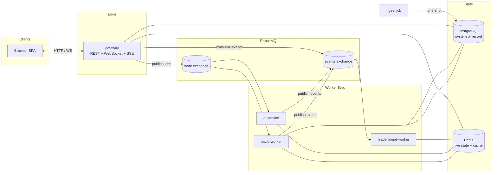
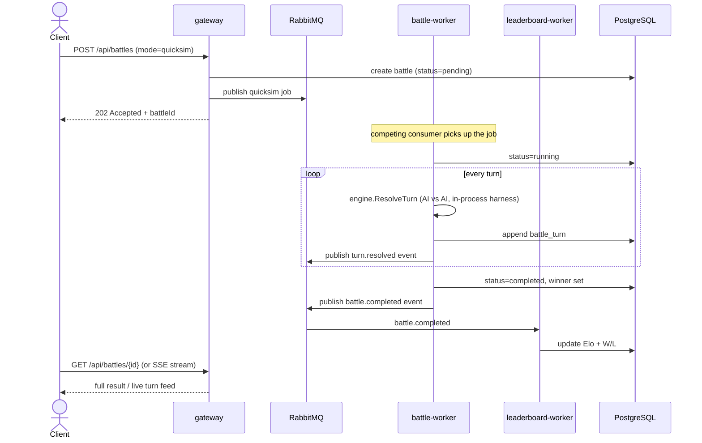
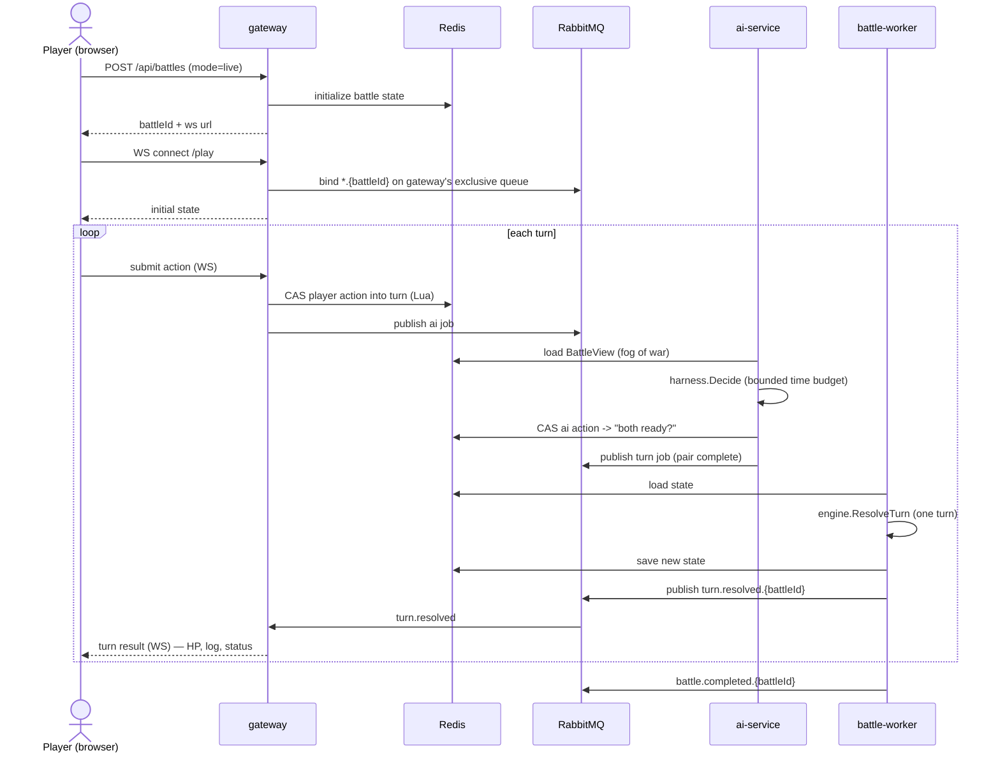
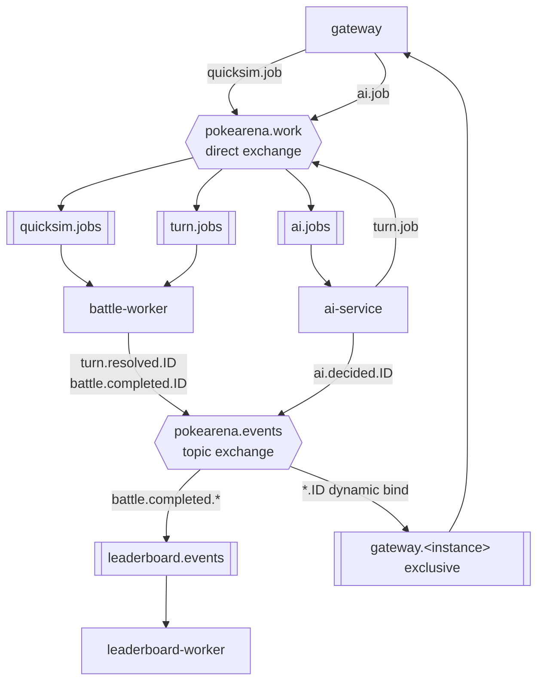
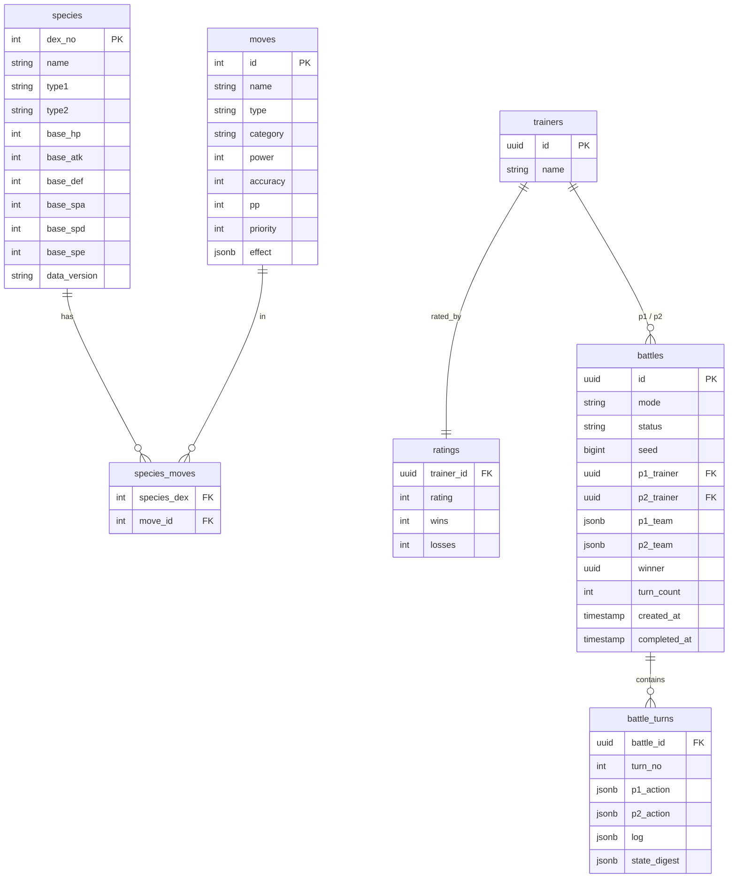

# PokéArena

> A distributed, event-driven Pokémon battle platform — built to demonstrate real system design, not a toy.

PokéArena simulates faithful, turn-by-turn Pokémon battles. It exposes **two delivery models over one battle engine**:

- **Quick Sim** — fire two teams at a queue; a worker pool resolves the battle AI-vs-AI. *Throughput-optimized.*
- **Live Battle** — you play turn-by-turn against an AI over a WebSocket, watching HP bars drain in real time. *Latency-optimized.*

The point of this repository is the **architecture**: queues, event fan-out, externalized session state, a distributed turn state machine, scheduled timeouts, and a horizontally scalable AI service. The battle engine is deliberately a *solved, verifiable* problem so the focus stays on how the system is built.


---

## Table of contents

- [Why this design](#why-this-design)
- [Architecture](#architecture)
- [The two battle modes](#the-two-battle-modes)
- [Message topology](#message-topology)
- [Event contracts](#event-contracts)
- [Data model](#data-model)
- [The battle engine](#the-battle-engine)
- [The AI agent harness](#the-ai-agent-harness)
- [Data ingestion](#data-ingestion)
- [Scaling & failure analysis](#scaling--failure-analysis)
- [Tech stack](#tech-stack)
- [Running locally](#running-locally)
- [Deploying to Railway](#deploying-to-railway)
- [Project layout](#project-layout)
- [Provenance](#provenance)

---

## Why this design

A battle is not a request you answer inline. It is **work** — it takes time, it can be watched, and finishing it has *consequences* (ratings change, stats update). That shape is what justifies every component:

| Requirement | Consequence in the design |
|---|---|
| Battles take time; the API must stay responsive | Battles are **jobs on a queue**, not synchronous calls. `POST /battles` returns `202` immediately. |
| One finished battle triggers several unrelated updates | A `battle.completed` **event** fans out to independent consumers (leaderboard, live push). |
| A live battle is a long-lived, interactive session | Battle state is **externalized to Redis**; workers stay stateless and rehydrate per turn. |
| Throughput must scale | Workers are **competing consumers** on one queue — scale = run more worker containers. |
| The AI must not block turn resolution | The AI is a **separate service** consuming its own queue, with a bounded time budget. |
| Crashes must not corrupt or duplicate battles | Turn resolution is **idempotent** and **deterministic** (seeded RNG stored in state). |

The engine itself is a **pure function** — `(state, actionP1, actionP2) → (newState, events)` — with no I/O. That purity is what lets the same logic power both a batch worker and a real-time turn resolver, and what makes every battle perfectly replayable.

---

## Architecture

Five Go binaries built from one module, plus three infrastructure dependencies.



| Service | Type | Responsibility |
|---|---|---|
| **gateway** | long-running | REST API, WebSocket live-battle endpoint, SSE spectating, serves the SPA. Owns *no* game logic. |
| **battle-worker** | long-running | Consumes battle/turn jobs, runs the engine, persists turns, publishes events. The horizontally scaled core. |
| **ai-service** | long-running | Consumes AI-decision jobs, runs the agent harness under a time budget, returns moves. |
| **leaderboard-worker** | long-running | Consumes `battle.completed`, recomputes Elo, updates the durable + cached leaderboard. |
| **ingest** | one-shot job | Loads the curated Pokémon dataset into PostgreSQL. Re-runnable and idempotent. |

> The **AI harness is a library** (`internal/ai`). `ai-service` is one *deployment* of it for live battles, where decisions must not block turn resolution and must scale independently. `battle-worker` imports the same library directly for Quick Sim, where round-tripping every turn through a queue would be pointless overhead. Same code, two deployment shapes — exactly like the engine.

---

## The two battle modes

### Quick Sim — async, AI vs AI



### Live Battle — real-time, you vs AI



Two coordination details worth calling out:

- **The turn pair is assembled with an atomic Redis Lua script.** Whichever writer completes the pair (player action or AI action) is the one that publishes the turn job. No races, no double-resolution.
- **A turn timer** (Redis sorted-set wheel) auto-resolves an idle turn with a default action, so a player walking away can't freeze a battle.

---

## Message topology

One broker, two exchanges. Routing keys are `{event}.{battleId}` so consumers can subscribe broadly *or* to a single battle.



- **`pokearena.work`** (direct) — competing-consumer work queues. Durable, manual-ack, prefetch-limited. A crashed worker's unacked job is redelivered.
- **`pokearena.events`** (topic) — domain events. `leaderboard-worker` binds the durable `leaderboard.events` queue to `battle.completed.*`. Each `gateway` instance declares an **exclusive, auto-delete** queue and **dynamically binds `*.{battleId}`** when a WebSocket opens — and unbinds on disconnect. Precise routing: an instance receives events only for battles it actually holds connections for.

---

## Event contracts

Events are versioned JSON. Every message carries `id`, `type`, `version`, `battle_id`, `occurred_at`.

| Event | Published by | Consumed by | Meaning |
|---|---|---|---|
| `battle.created` | gateway | — (audit) | A battle row exists. |
| `battle.started` | battle-worker | gateway | Simulation/turn loop began. |
| `turn.resolved` | battle-worker | gateway | One turn computed; carries the turn log + post-state digest. |
| `ai.decided` | ai-service | gateway | The AI chose an action (carries `reasoning` for the UI). |
| `battle.completed` | battle-worker | leaderboard-worker, gateway | Winner decided; carries final teams + turn count. |

Idempotency: consumers treat events as **at-least-once**. `leaderboard-worker` applies a rating delta only if `battle_id` is not already in `rating_applied` (a uniqueness guard) — a redelivered `battle.completed` is a no-op.

---

## Data model

PostgreSQL is the **system of record**. Redis holds only *derived* or *ephemeral* state (live battle state, caches, the leaderboard ZSET) and can be rebuilt from Postgres.



---

## The battle engine

A faithful single-battle engine. Deterministic given its seed; the RNG state is serialized *with* the battle state, so any battle replays bit-for-bit from its turn log.

**Derived stats** (level fixed for fair play, IV 31 / neutral nature):

```
HP   = floor((2·Base + IV) · L / 100) + L + 10
Stat = floor((2·Base + IV) · L / 100) + 5
```

**Damage** (Gen-3+ standard):

```
Damage = (((2·L/5 + 2) · Power · A/D) / 50 + 2) · STAB · Type · Crit · Random · Burn
```

- `A/D` — Attack/Defense for **physical** moves, Sp.Atk/Sp.Def for **special**. Status moves deal no damage.
- `STAB` ×1.5 if the move's type matches the attacker. `Type` is the product over the defender's types ∈ {0, ¼, ½, 1, 2, 4}.
- `Crit` ×1.5 (~1/24). `Random` uniform across 0.85–1.00. `Burn` ×0.5 on physical damage when burned.

**Turn order** — higher Speed first, but **priority bracket** wins (e.g. Quick Attack +1). Ties broken by the seeded RNG.

**Modeled:** full 18×18 type chart, physical/special/status, accuracy & PP, priority, crits, **status conditions** (burn, poison, paralysis, sleep, freeze), **stat stages** (−6…+6), switching on faint. **Out of scope (v1):** abilities, held items, weather — *content breadth*, not *mechanical depth*. The engine exposes pre/post-damage and turn-start modifier hooks so they slot in later without touching the core.

See `internal/engine/engine_test.go` for damage cases validated against published calculations.

---

## The AI agent harness

A **switchable strategy interface** — the engine never knows which agent is plugged in. The human player is itself just an `Agent` whose `Decide()` blocks on WebSocket input.

```go
type Agent interface {
    Decide(view BattleView) (Action, error)
}
```

`BattleView` is **strict fog of war**: own team in full, but only the opponent's *active* Pokémon and its *revealed* moves. There is no cheating mode — the AI plays on exactly the information a human has.

| Agent | Difficulty | How it works |
|---|---|---|
| `RandomAgent` | — | Uniform legal action. Test control + last-resort fallback. |
| `HeuristicAgent` | Easy | Depth-0. Scores actions by expected damage × type multiplier, KO/STAB bonuses, switch-on-bad-matchup. |
| `ExpectimaxAgent` | Hard | Depth-limited search over a **simultaneous-move, stochastic** game: builds the action payoff matrix and takes the **maximin** action; collapses damage rolls to expectation (chance nodes); handles hidden movesets by **determinization**; iterative deepening under a time budget; alpha-beta + transposition table. |
| `LLMAgent` | Nightmare *(optional)* | Claude reasons over the `BattleView` via structured output; gated behind an API key. |

**The harness wraps every agent** with a time budget and a fallback chain `LLM → Expectimax → Heuristic → Random`. `HeuristicAgent` never fails, so a battle can never hang on the AI. Every decision (and any LLM reasoning) is written to the turn log, so replays reproduce AI moves exactly.

---

## Data ingestion

Pokémon game data is **slowly-changing reference data** — it changes a few times per *decade*, not a feed.

- **Source of truth is a static, versioned dataset**, not a live API. A curated snapshot lives in `data/` (`pokedex.json`, `moves.json`, `typechart.json`), pinned in-repo. **The build has zero network dependency** — it runs offline and in CI.
- **`ingest` is a decoupled, re-runnable job.** It upserts (`INSERT … ON CONFLICT DO UPDATE`) keyed on stable natural keys, tagged with a `data_version`. Re-running converges.
- **Refresh is deliberate, staged and validated:** a refresh loads into a staging schema, validates (type chart still 18×18, every species has stats + ≥1 move, damage spot-checks), and only **promotes on pass**. Bad upstream data can never break a running deployment.
- **Cache invalidation is free:** Redis keys are namespaced by `data_version` (`species:v1:25`). A new version is a new namespace; stale entries age out.

---

## Scaling & failure analysis

| Concern | Mechanism |
|---|---|
| **Throughput** | `battle-worker` / `ai-service` are competing consumers with bounded prefetch. Scale = more replicas. No coordination needed. |
| **Worker crash mid-job** | Job was manual-ack; unacked on disconnect → redelivered. Turn resolution is keyed `(battle_id, turn_no)` and the seeded RNG state lives *in* the saved state → recomputation is **identical**. Safe. |
| **Duplicate events** | Consumers are idempotent (`rating_applied` guard; turn upsert on `(battle_id, turn_no)`). |
| **ai-service down** | Live turns wait on the turn timer, which resolves with a default action. Quick Sim is unaffected (in-process harness). |
| **leaderboard-worker down** | Battles still run; `battle.completed` events queue durably and drain on recovery. |
| **gateway instance dies** | Its exclusive queue auto-deletes; clients reconnect to another instance, which rehydrates battle state from Redis. State outlives the connection. |
| **Redis eviction of live state** | Battle state has a TTL; the durable record + turn log in Postgres can rehydrate an in-progress battle. |
| **Broker backpressure** | Queues are bounded; the gateway sheds load with `503` when depth exceeds a threshold rather than accepting unbounded work. |

---

## Tech stack

| Concern | Choice | Why |
|---|---|---|
| Language | **Go 1.26** | True concurrency for the worker fleet, tiny static binaries, fast cold starts. |
| HTTP router | `go-chi/chi` | Idiomatic, lightweight, middleware-friendly. |
| WebSocket | `gorilla/websocket` | The de-facto standard. |
| Database | **PostgreSQL** + `jackc/pgx` | Relational integrity for the system of record; `jsonb` for flexible team/log blobs. |
| Broker | **RabbitMQ** + `amqp091-go` | Work queues *and* topic fan-out in one broker; per-message ack. |
| Cache / state | **Redis** + `go-redis` | Live battle state, read-through cache, leaderboard sorted set, Lua-atomic turn coordination. |
| Frontend | Vanilla JS SPA | No build step — keeps the demo dependency-free. |

> Trade-off noted honestly: Python/FastAPI would have been faster to write; Go was chosen because the worker fleet's concurrency story and small images are exactly what this system is about. Concurrency ultimately lives in the *architecture* (scale the workers), so the language choice is about operability, not correctness.

---

## Running locally

Requires only Docker.

```bash
cp .env.example .env
docker compose up --build        # starts postgres, rabbitmq, redis + all 5 services
```

`ingest` runs automatically on first boot and seeds the Pokédex. Then open:

| URL | What |
|---|---|
| http://localhost:8080 | The SPA — browse the Pokédex, build teams, battle |
| http://localhost:8080/api/healthz | Health check |
| http://localhost:15672 | RabbitMQ management UI (`guest`/`guest`) |

```bash
make test     # run the engine + AI unit tests
make down     # stop and remove the stack
```

---

## Deploying to Railway

Railway hosts each service as a container, plus managed PostgreSQL and Redis. RabbitMQ runs from the official image. Full walkthrough in [`DEPLOY.md`](DEPLOY.md).

```bash
railway init
railway up        # builds from the Dockerfile, one service per binary
```

---

## Project layout

```
cmd/                    # one main.go per binary
  gateway/  battle-worker/  ai-service/  leaderboard-worker/  ingest/
internal/
  config/     # env-driven config
  domain/     # core types: Species, Move, Pokemon, Battle
  engine/     # the pure battle engine + tests
  ai/         # the agent harness
  store/      # PostgreSQL repositories + migrations
  cache/      # Redis: live state, cache, leaderboard
  mq/         # RabbitMQ: topology, publishers, consumers
  messages/   # versioned event/message schemas
  httpapi/    # gateway handlers, WebSocket, SSE
data/         # curated, pinned Pokémon dataset
migrations/   # SQL schema
web/          # the static SPA
docs/         # architecture diagram
```

---

## Provenance

This system was built incrementally — every component is its own commit. `git log` is the build journal: schema, then engine, then AI, then services. A copy-paste would be one giant dump; incremental authorship is not. Pick any file and any function — the design rationale above explains why it exists.

Pokémon data and mechanics are public reference material; the engine, the system, and every line of the implementation here are original work.
