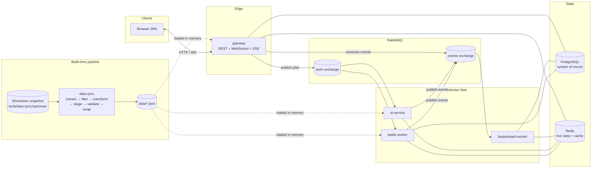
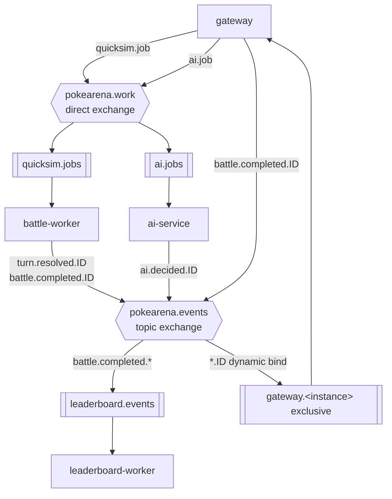
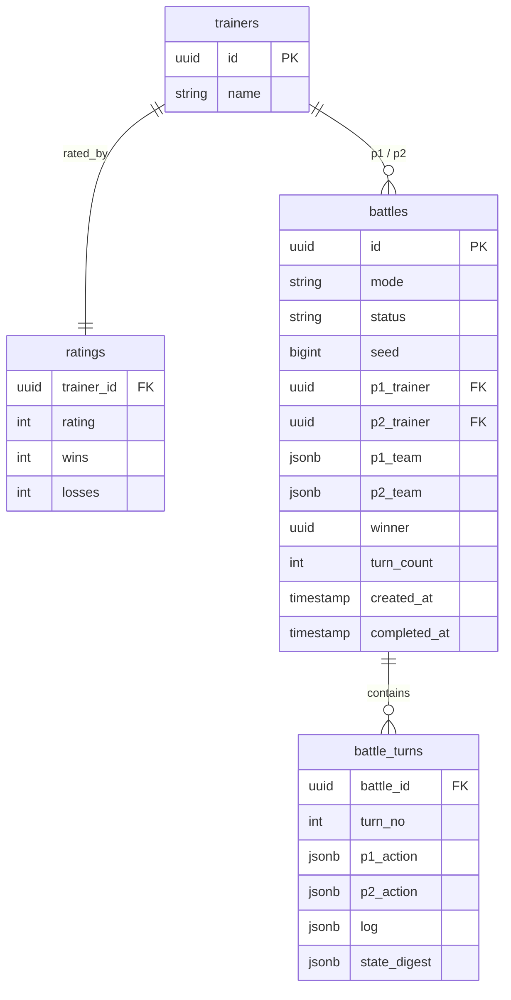
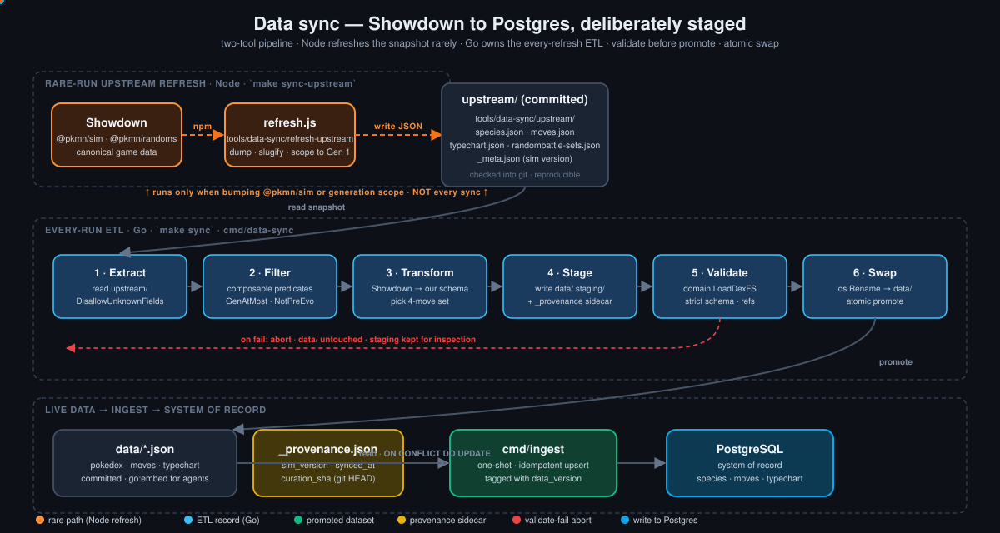

# PokéArena

> A distributed, event-driven Pokémon battle platform — built to demonstrate real system design, not a toy.

PokéArena simulates faithful, turn-by-turn Pokémon battles. It exposes **three battle modes over one engine**:

- **Quick Sim** — fire two teams at a queue; a worker pool resolves the battle AI-vs-AI. *Throughput-optimized.*
- **Live vs AI** — you play turn-by-turn against the internal AI harness over a WebSocket, watching HP bars drain in real time. *Latency-optimized.*
- **Pv-Agent** — you play against an external agent (Claude Code, any MCP client, or our reference harness) over a second WebSocket slot. The agent runs on the player's machine, joins the battle like any other trainer, and sees only fog-of-war. *Agent-extensibility showcase.* See [`docs/mcp-protocol.md`](docs/mcp-protocol.md) for the MCP path and [`docs/agent-harness.md`](docs/agent-harness.md) for the agent-layer design.

The point of this repository is the **architecture**: queues, event fan-out, externalized session state, a distributed turn state machine, scheduled timeouts, a horizontally scalable AI service, and a clean agent-side protocol that lets *any* external player (LLM, RL agent, scripted bot) drive a battle through the same boundary. The battle engine is deliberately a *solved, verifiable* problem so the focus stays on how the system is built.

| Set up — pick a mode, draft both teams | In battle — HP, type effectiveness, full turn log |
|---|---|
|  |  |


---

## Table of contents

- [Why this design](#why-this-design)
- [Architecture](#architecture)
- [The three battle modes](#the-three-battle-modes) — Quick Sim, Live vs AI, Pv-Agent
- [Message topology](#message-topology)
- [Event contracts](#event-contracts)
- [Data model](#data-model)
- [The battle engine](#the-battle-engine)
- [The AI agent harness](#the-ai-agent-harness)
- [Data pipeline](#data-pipeline)
- [Scaling & failure analysis](#scaling--failure-analysis)
- [Tech stack](#tech-stack)
- [Running locally](#running-locally)
- [Connect your agent (Pv-Agent)](#connect-your-agent-pv-agent)
- [Project layout](#project-layout)
- [Provenance](#provenance)

---

## Why this design

A battle is not a request you answer inline. It is **work** — it takes time, it can be watched, and finishing it has *consequences* (ratings change, stats update). That shape is what justifies every component:

| Requirement | Consequence in the design |
|---|---|
| Battles take time; the API must stay responsive | Battles are **jobs on a queue**, not synchronous calls. `POST /battles` returns `202` immediately. |
| One finished battle triggers several unrelated updates | A `battle.completed` **event** fans out to independent consumers (leaderboard, live push). |
| A live battle is a long-lived, interactive session | Battle state is **externalized to Redis**; workers stay stateless and rehydrate per turn. |
| Throughput must scale | Workers are **competing consumers** on one queue — scale = run more worker containers. |
| The AI must not block turn resolution | The AI is a **separate service** consuming its own queue, with a bounded time budget. |
| Crashes must not corrupt or duplicate battles | Turn resolution is **idempotent** and **deterministic** (seeded RNG stored in state). |

The engine itself is a **pure function** — `(state, actionP1, actionP2) → (newState, events)` — with no I/O. That purity is what lets the same logic power both a batch worker and a real-time turn resolver, and what makes every battle perfectly replayable.

---

## Architecture

Six Go binaries built from one module — five long-running cloud services plus one user-side MCP server — over three infrastructure dependencies.



| Service | Type | Responsibility |
|---|---|---|
| **gateway** | long-running | REST API, WebSocket live-battle endpoint, SSE spectating, serves the SPA. Owns *no* game logic. |
| **battle-worker** | long-running | Consumes Quick Sim jobs, simulates whole battles, persists every turn, publishes events. The horizontally scaled core. |
| **ai-service** | long-running | Consumes AI-decision jobs, runs the agent harness under a time budget, returns moves. |
| **leaderboard-worker** | long-running | Consumes `battle.completed`, recomputes Elo, updates the durable + cached leaderboard. |
| **pokearena-mcp** | user-side | Stdio MCP server that bridges Claude Code's tool-call surface to the gateway's live-slot WebSocket protocol. Runs on the player's machine, not in the cloud. See [Connect your agent](#connect-your-agent-pv-agent). |

> The **AI harness is a library** (`internal/ai`). `ai-service` is one *deployment* of it for live battles, where decisions must not block turn resolution and must scale independently. `battle-worker` imports the same library directly for Quick Sim, where round-tripping every turn through a queue would be pointless overhead. Same code, two deployment shapes — exactly like the engine.

---

## The three battle modes

### Quick Sim — async, AI vs AI



### Live vs AI — real-time, you vs internal harness



Two design points worth calling out:

- **The gateway resolves the turn inline.** Resolving a turn is a pure, microsecond function call — putting it on a queue would buy latency and moving parts and nothing else. What *is* worth offloading is the AI's decision: a variable-latency game-tree search, or an LLM round-trip. So the gateway offloads exactly that to the `ai-service`, and resolves the turn itself when the reply arrives, correlated by job id. The gateway holds no battle state — it all lives in Redis, so any gateway instance can serve any battle.
- **A turn timer** bounds every decision. If the player idles past it, a default action is filled in; if the `ai-service` is unreachable, the gateway falls back to a local heuristic. A battle can never freeze on a missing decision.

### Pv-Agent — real-time, you vs an external agent

Same engine, same `BattleView`, but the second trainer slot is **claimable by an external WebSocket client** instead of bound to the internal AI. The headline client is Claude Code via a local MCP server; any MCP client (or any WS client speaking the slot protocol) can take the slot.



Three things to call out:

- **Topology: the MCP server runs on the user's machine, not in our cloud.** Each user's MCP server is single-tenant by construction. Our gateway sees authenticated WS clients with one-use join tokens — a problem we already understand — instead of forcing us to operate a second multi-tenant service with its own auth domain. This matches how every production MCP server is shaped (GitHub MCP, filesystem MCP, etc.: user-side adapter, real service on the network).
- **The MCP server is a fog-of-war proxy, not a privileged client.** Its `view()` tool returns a `BattleView` — a strict fog-of-war projection of the battle — never `BattleState`. Cheating is impossible-by-construction, not a policy the agent has to honor.
- **Long-poll over MCP, by necessity.** Claude only acts via tool calls, and tool calls are unary. The only way to surface "your turn now" without busy-polling is a `wait()` tool that blocks on the server side until the turn arrives (or a timeout, currently 60s — a robustness ceiling, not a "Claude needs reminding" interval). MCP notifications exist but don't drive the agent loop, so they can't replace `wait()`.

The wire-level protocol between *any* trainer client (browser, MCP server, a future CLI, a Python RL trainer) and the gateway is the same. The MCP server is one presentation layer over that protocol; the SPA is another.

**What it looks like in practice** — Claude in the loop, reasoning over the `BattleView`, calling `pokearena - act` and `pokearena - wait` as ordinary tool calls:


Design docs: [`docs/mcp-protocol.md`](docs/mcp-protocol.md) for the agent-facing tool surface, state machine, and alternatives considered; [`docs/live-pvp.md`](docs/live-pvp.md) for the underlying claimable-slot protocol and join-token security model.

**Try it:** see [Connect your agent (Pv-Agent)](#connect-your-agent-pv-agent) below for the four-step setup.

---

## Message topology

One broker, two exchanges. Routing keys are `{event}.{battleId}` so consumers can subscribe broadly *or* to a single battle.



- **`pokearena.work`** (direct) — competing-consumer work queues. Durable, manual-ack, prefetch-limited. A crashed worker's unacked job is redelivered.
- **`pokearena.events`** (topic) — domain events. `leaderboard-worker` binds the durable `leaderboard.events` queue to `battle.completed.*`. Each `gateway` instance declares an **exclusive, auto-delete** queue and **dynamically binds `*.{battleId}`** when a WebSocket opens — and unbinds on disconnect. Precise routing: an instance receives events only for battles it actually holds connections for.

---

## Event contracts

Events are JSON, published to the topic exchange with routing key
`{event}.{battleId}` — the type and the battle are in the key itself, so a
consumer can bind one battle or every battle of a type.

| Event | Published by | Consumed by | Meaning |
|---|---|---|---|
| `battle-started` | battle-worker | gateway (SSE) | A Quick Sim's turn loop began. |
| `turn-resolved` | battle-worker | gateway (SSE) | One Quick Sim turn; carries the turn log + post-turn state. |
| `ai-decided` | ai-service | gateway | The AI's chosen action for a live battle, correlated by job id. |
| `battle-completed` | battle-worker, gateway | leaderboard-worker | A battle finished; the worker reloads the authoritative record. |

Idempotency: consumers treat events as **at-least-once**. `leaderboard-worker` applies a rating change only if `battle_id` is not already in `rating_applied` (a uniqueness guard), so a redelivered `battle-completed` is a no-op.

---

## Data model

The system of record is **split by category, not by store**:

- **Reference data** — species, moves, typechart — lives in committed JSON under `data/`. Every service `LoadDex`s it into memory at boot. It is never written from a running service and never queried at request time. This is what makes the engine a pure function and battles bit-for-bit replayable.
- **Transactional state** — trainers, ratings, battles, turns — lives in **PostgreSQL**. This is what changes, what needs ACID, and what benefits from history.
- **Derived / ephemeral state** — live battle state, the leaderboard ZSET, PvP slot tokens — lives in **Redis** and can be rebuilt from Postgres + the JSON dex.

Only the Postgres schema is drawn below; reference data has no rows.



---

## The battle engine

A faithful single-battle engine. Deterministic given its seed; the RNG state is serialized *with* the battle state, so any battle replays bit-for-bit from its turn log.

**Derived stats** (level fixed for fair play, IV 31 / neutral nature):

```
HP   = floor((2·Base + IV) · L / 100) + L + 10
Stat = floor((2·Base + IV) · L / 100) + 5
```

**Damage** (Gen-3+ standard):

```
Damage = (((2·L/5 + 2) · Power · A/D) / 50 + 2) · STAB · Type · Crit · Random · Burn
```

- `A/D` — Attack/Defense for **physical** moves, Sp.Atk/Sp.Def for **special**. Status moves deal no damage.
- `STAB` ×1.5 if the move's type matches the attacker. `Type` is the product over the defender's types ∈ {0, ¼, ½, 1, 2, 4}.
- `Crit` ×1.5 (~1/24). `Random` uniform across 0.85–1.00. `Burn` ×0.5 on physical damage when burned.

**Turn order** — higher Speed first, but **priority bracket** wins (e.g. Quick Attack +1). Ties broken by the seeded RNG.

**Modeled:** full 18×18 type chart, physical/special/status, accuracy & PP, priority, crits, **status conditions** (burn, poison, toxic with escalating 1/16, 2/16, … damage, paralysis, sleep with Gen-5+ switch reset, freeze with Fire-thaw), **volatiles** (confusion at 33% self-hit chance, flinch), **stat stages** for all six combat stats *plus* Accuracy/Evasion on the Gen-3+ `(3+s)/3` curve, switching on faint, Rest. **Out of scope (v1):** abilities, held items, weather, terrain, hazards, multi-hit and two-turn moves, substitute, partial-trapping — *content breadth*, not *mechanical depth*. The engine factors turn execution into named phases (`canAct → choosePP → announceMove → resolveAccuracy → dealDamage → applyDamageEffects → applyResidual`) so new mechanics slot in at the phase boundary rather than threading through one mega-function.

The move schema is Showdown-shaped: `Primary` (status-move effect), `Self` (user-applied effect), `Secondaries[]` (post-damage chance effects), `Flags[]` (contact, punch, bite, sound, powder, high-crit, bypass-acc). See [`docs/battle-state.md`](docs/battle-state.md) for the schema contract and the design diary entry behind the phase split. `internal/engine/engine_test.go` covers damage; `internal/engine/mechanics_test.go` covers status/volatile interactions.

---

## The AI agent harness

A **switchable strategy interface** — the engine never knows which agent is plugged in. The human player is itself just an `Agent` whose `Decide()` blocks on WebSocket input.

```go
type Agent interface {
    Decide(view BattleView) (Action, error)
}
```

`BattleView` is **strict fog of war**: own team in full, but only the opponent's *active* Pokémon and its *revealed* moves. There is no cheating mode — the AI plays on exactly the information a human has.

| Agent | Difficulty | How it works |
|---|---|---|
| `RandomAgent` | — | Uniform legal action. Test control + last-resort fallback. |
| `HeuristicAgent` | Easy | Depth-0. Scores actions by expected damage × type multiplier, KO/STAB bonuses, switch-on-bad-matchup. |
| `ExpectimaxAgent` | Hard | Depth-limited search over a **simultaneous-move, stochastic** game: builds the action payoff matrix and takes the **maximin** action; collapses damage rolls to expectation (chance nodes); handles hidden movesets by **determinization**; iterative deepening under a time budget; alpha-beta + transposition table. |

**The harness wraps every agent** with a time budget and a fallback chain `Expectimax → Heuristic → Random`. `HeuristicAgent` never fails, so a battle can never hang on the AI. Every decision is written to the turn log, so replays reproduce AI moves exactly.

> **No LLM lives in this harness.** The agents above are programmatic only; LLM play happens *client-side of the gateway WS*, not inside `ai-service`. Core services hold no API keys and have no provider SDKs — that concern belongs to the agent layer (`cmd/pokearena-agent`, `cmd/pokearena-mcp`), where it's optional and separately deployable. See [`docs/agent-harness.md`](docs/agent-harness.md) for the boundary and why we drew it there.

---

## Data pipeline

Pokémon game data is **slowly-changing reference data** — it changes a few times per *decade*, not a feed. It is treated like code: pinned in-repo, refreshed deliberately, committed, deployed with the binaries. **No database is involved** — the pipeline ends at `data/*.json`, which every service loads into memory at boot.



**Two tools, two cadences, one promised property: the live dataset is never partially-updated.**

| Stage | Tool | Cadence | What it does |
|---|---|---|---|
| Upstream refresh | `tools/data-sync/refresh-upstream/refresh.js` (Node) | rare — only when bumping `@pkmn/sim` or generation scope | Pulls Showdown's canonical data via `@pkmn/sim` + `@pkmn/randoms`, writes a frozen snapshot to `tools/data-sync/upstream/` (committed) |
| ETL | `cmd/data-sync` (Go) | every refresh — `make sync` | **Extract** the snapshot → **Filter** with composable predicates → **Transform** to our schema → **Stage** to `data/.staging/` → **Validate** via `domain.LoadDexFS` → **Swap** with `os.Rename` |
| Validation only | `cmd/data-validate` (Go) | CI | Strict-loads `data/*.json` with `DisallowUnknownFields`, fails non-zero on any drift |

The key design choices:

- **JSON is the system of record for reference data.** Every long-running service (`gateway`, `battle-worker`, `ai-service`) calls `domain.LoadDex` against `data/*.json` at startup and serves the engine, the agent harness, and the SPA's Pokédex API from that in-memory copy. There is no `species` or `moves` table; there is no ingest step. Postgres holds only transactional state.
- **The curated dataset lives in two layers, not one.** `tools/data-sync/upstream/` is the *raw* Showdown dump — every species, every move, internally consistent for a specific `@pkmn/sim` release. `data/` is the *curated* live dataset — narrowed by filters, transformed to our schema, validated. Both are committed, so any sync is fully reproducible offline.
- **Curation is code, not configuration.** No `curation.json` file. Scope rules live in `cmd/data-sync/filter.go` as a chain of `SpeciesFilter{Name, Keep}` predicates (today: `GenAtMost(1)`, `NotPreEvolution()`). Adding a filter = one new function + one line in the chain. Removing = delete the line. Diffs read like the intent.
- **Validate before promote, atomic on swap.** The Go orchestrator stages every output to `data/.staging/*` first and runs the same strict schema loader the engine uses. If validation fails, `data/` is untouched and the staging dir is left for inspection. The final step is `os.Rename` per file — a half-finished run can never produce a partially-updated tree.
- **Provenance travels with the dataset.** `data/_provenance.json` records the `@pkmn/sim` version, the sync timestamp, the source generation, and the curation git SHA at sync time. Reproducing any past state is `git checkout <sha>` + `make sync`.
- **Reproducibility is two things, not one.** *Deterministic* (same inputs, same outputs) is bought by committing both `package-lock.json` and the `upstream/` snapshot. *Auditable* (we can prove what produced what) is bought by the sidecar provenance file.

```bash
make sync-upstream    # rare: Node helper pulls Showdown into upstream/
make sync             # every-refresh: Go ETL stages, validates, swaps data/
make sync-diff        # same as sync but stops after validate — eyeball the diff
make validate-data    # CI: strict-load data/*.json, exit non-zero on drift
```

Failure modes are explicit and recoverable. Unknown fields fail loud (strict JSON loader). Unknown move flags or status names fail loud. Unknown volatile conditions are *dropped with a warning* (the snapshot's vocabulary outruns the engine; we'd rather under-include than crash). The atomic swap is per-file, so an interrupted run leaves a consistent `data/` even if it leaves an orphaned staging dir.

Full schema and stage contracts: [`tools/data-sync/README.md`](tools/data-sync/README.md) and [`docs/battle-state.md`](docs/battle-state.md).

---

## Scaling & failure analysis

| Concern | Mechanism |
|---|---|
| **Throughput** | `battle-worker` / `ai-service` are competing consumers with bounded prefetch. Scale = more replicas. No coordination needed. |
| **Worker crash mid-job** | Job was manual-ack; unacked on disconnect → redelivered. Turn resolution is keyed `(battle_id, turn_no)` and the seeded RNG state lives *in* the saved state → recomputation is **identical**. Safe. |
| **Duplicate events** | Consumers are idempotent (`rating_applied` guard; turn upsert on `(battle_id, turn_no)`). |
| **ai-service down** | The gateway falls back to a local heuristic for the AI's move, so live battles continue. Quick Sim is unaffected (in-process harness). |
| **leaderboard-worker down** | Battles still run; `battle.completed` events queue durably and drain on recovery. |
| **gateway instance dies** | Its exclusive queue auto-deletes; clients reconnect to another instance, which rehydrates battle state from Redis. State outlives the connection. |
| **Redis eviction of live state** | Battle state has a TTL; the durable record + turn log in Postgres can rehydrate an in-progress battle. |
| **Broker backpressure** | Queues are bounded; the gateway sheds load with `503` when depth exceeds a threshold rather than accepting unbounded work. |

---

## Tech stack

| Concern | Choice | Why |
|---|---|---|
| Language | **Go 1.26** | True concurrency for the worker fleet, tiny static binaries, fast cold starts. |
| HTTP router | `go-chi/chi` | Idiomatic, lightweight, middleware-friendly. |
| WebSocket | `gorilla/websocket` | The de-facto standard. |
| Database | **PostgreSQL** + `jackc/pgx` | Relational integrity for the system of record; `jsonb` for flexible team/log blobs. |
| Broker | **RabbitMQ** + `amqp091-go` | Work queues *and* topic fan-out in one broker; per-message ack. |
| Cache / state | **Redis** + `go-redis` | Live battle state, read-through Pokédex cache, leaderboard sorted set. |
| Frontend | Vanilla JS SPA | No build step — keeps the demo dependency-free. |

> Trade-off noted honestly: Python/FastAPI would have been faster to write; Go was chosen because the worker fleet's concurrency story and small images are exactly what this system is about. Concurrency ultimately lives in the *architecture* (scale the workers), so the language choice is about operability, not correctness.

---

## Running locally

Requires only Docker.

```bash
cp .env.example .env
docker compose up --build        # starts postgres, rabbitmq, redis + the 4 Go services
```

The Pokédex ships with the image — every service reads it from `/app/data/*.json` at startup. Then open:

| URL | What |
|---|---|
| http://localhost:8080 | The SPA — browse the Pokédex, build teams, battle |
| http://localhost:8080/api/healthz | Health check |
| http://localhost:15672 | RabbitMQ management UI (`guest`/`guest`) |

```bash
make test     # run the engine + AI unit tests
make down     # stop and remove the stack
```

---

## Connect your agent (Pv-Agent)

There are **two ways** to put an LLM in the second slot — both run on your
machine, both hold *your* API key, neither requires anything from the cloud
deploy. Pick one:

| Path | Binary | Best for |
|---|---|---|
| **A. Claude Code via MCP** | `cmd/pokearena-mcp` | You already use Claude Code; you want the agent to live inside an interactive session you can talk to. |
| **B. Reference harness** | `cmd/pokearena-agent` | You want a one-shot CLI: paste URL, watch it play. Headless, scriptable, swap providers by changing one file. |

Both speak the same gateway WS protocol; design rationale in [`docs/agent-harness.md`](docs/agent-harness.md).

---

### Path A — Claude Code via MCP

`pokearena-mcp` is an [MCP server](https://modelcontextprotocol.io) that
bridges Claude Code's tool-call surface to the gateway's WebSocket protocol.
The same setup works whether the gateway is `localhost:8080` (you ran
`docker compose up`) or a deployed URL.

### 1. Build the binary

```bash
go build -o ./bin/pokearena-mcp ./cmd/pokearena-mcp
```

> Or `go install ./cmd/pokearena-mcp` to put it on your `$PATH`.

### 2. Register it with Claude Code

Pointed at a local gateway:

```bash
claude mcp add pokearena -- "$(pwd)/bin/pokearena-mcp"
```

Pointed at a deployed gateway (note `wss://` for TLS):

```bash
claude mcp add pokearena \
  --env POKEARENA_GATEWAY_URL=wss://pokearena.example \
  -- "$(pwd)/bin/pokearena-mcp"
```

Verify it loaded:

```bash
claude mcp list   # should include "pokearena"
```

The MCP server is added to the *current project's* config by default
(`-s user` to share it across all projects on your machine).

### 3. Create a battle in the browser

Open the gateway URL, pick **"Pv-Player — share a link to play"**, draft
both teams, hit **Start battle**. The arena view shows a share banner
with a URL like `http://…/?battle=ID&slot=p2&token=…`. Copy it — that's
Claude's seat.

### 4. Hand the URL to Claude Code

Open a **fresh** Claude Code session (one started *before* the `claude mcp add`
won't see the new MCP) and paste a prompt like:

> *Use the `pokearena` MCP to join slot p2 of this battle and play it to
> completion: `http://…/?battle=ID&slot=p2&token=…`. Extract `battle_id`,
> `slot`, and `token` from the URL, call `join_battle`, then loop:
> `wait` → `view` → pick the best legal action → `act`, until you see
> `terminal: true`.*

The browser tab is your seat (p1); make your moves there. Both sides
must submit each turn before the gateway resolves it — Claude will block
in `wait` until you act, and vice versa.

### Troubleshooting

| Symptom | Likely cause |
|---|---|
| `claude mcp list` doesn't show pokearena | Ran the add command from a different directory; either re-run from the project root or use `-s user` for machine-wide scope. |
| Claude says it has no `pokearena` tool | Session was started before `claude mcp add` ran. Open a new session. |
| `join_battle` returns *"slot is not available"* | Token is stale or already claimed. Create a fresh battle in the browser. |
| `wait` keeps timing out | Your side (the browser) hasn't acted yet. The gateway only sends a turn frame once both players have submitted. |
| You want to see the protocol in action without Claude | `go run ./cmd/mcp-smoke` walks one full turn against the running gateway with verbose checkpoints. |

The same binary works for any MCP client (Claude Code is the headline
case; the protocol is agent-agnostic). The full tool surface and design
rationale are in [`docs/mcp-protocol.md`](docs/mcp-protocol.md).

---

### Path B — Reference harness (`pokearena-agent`)

The reference harness is a single self-contained binary. It embeds the
Pokémon dataset, takes your API key from the environment, dials the
gateway directly, and plays the battle to completion — no MCP layer, no
Claude Code dependency. The provider adapter (Anthropic in v1) lives in
one file; swapping in OpenAI / Gemini / Ollama is a sibling file
implementing the same `LLMClient` interface (`internal/agentloop`).

```bash
# 1. Build
go build -o ./bin/pokearena-agent ./cmd/pokearena-agent

# 2. Set your key (your machine, your key — the cloud holds nothing)
export ANTHROPIC_API_KEY=sk-ant-…

# 3. In the SPA: pick "Pv-Player — share a link to play", draft both
# teams, hit Start. Copy the share URL.

# 4. Hand the URL to the agent
./bin/pokearena-agent 'http://localhost:8080/?battle=ID&slot=p2&token=…'
```

It will log each turn: which action it picked, with the model's
one-sentence reasoning. The browser tab is still your seat (p1); make
your moves there. The agent exits cleanly when the battle ends.

| Flag | Default | What |
|---|---|---|
| `--model` | `claude-haiku-4-5-20251001` | Anthropic model id. Switch to opus for stronger play at higher cost. |
| `--turn-timeout` | `12s` | Per-turn LLM budget. The gateway default-actions the slot if exceeded. |
| `--data-version` | `gen1-v1` | Must match the gateway's `DATA_VERSION` env. |

The full design — why `pokearena-agent` exists alongside `pokearena-mcp`,
why both talk gateway WS directly, what `internal/agentloop` looks like
— is in [`docs/agent-harness.md`](docs/agent-harness.md).

---

## Project layout

```
cmd/                       # one main.go per binary
  gateway/  battle-worker/  ai-service/  leaderboard-worker/
  pokearena-mcp/           # user-side MCP server for Pv-Agent (Claude Code path)
  pokearena-agent/         # reference LLM harness (Pv-Agent CLI)
  data-sync/               # Go ETL orchestrator: extract → filter → transform → stage → validate → swap
  data-validate/           # standalone strict validator (CI-friendly)
  pvp-smoke/               # integration test driver for the gateway WS path
  mcp-smoke/               # integration test driver for pokearena-mcp
internal/
  config/      # env-driven config
  domain/      # core types: Species, Move, Pokemon, Battle + strict JSON loader
  engine/      # the pure battle engine + tests
  ai/          # the agent harness
  store/       # PostgreSQL repositories + migrations
  cache/       # Redis: live state, cache, leaderboard, PvP slot tokens
  mq/          # RabbitMQ: topology, publishers, consumers
  messages/    # versioned event/message schemas
  httpapi/     # gateway handlers, WebSocket, SSE
  mcpserver/   # pokearena-mcp internals: session + gwclient + tools
  protocol/    # shared wire types (gateway ↔ MCP / CLI / RL trainer)
data/          # curated, pinned Pokémon dataset + _provenance.json sidecar
tools/
  data-sync/             # the build-time data pipeline (see its README)
    refresh-upstream/    # Node helper (rare): pull Showdown to a frozen snapshot
    upstream/            # committed snapshot — input to cmd/data-sync
migrations/    # SQL schema
web/           # the static SPA
docs/          # architecture diagram, screenshots, and stable design docs (live-pvp, mcp-protocol, battle-state, data-pipeline)
backlog/       # chronological diary entries (timestamped filenames); action items live in GitHub Issues
```

---

## Provenance

This system was built incrementally — every component is its own commit. `git log` is the build journal: schema, then engine, then AI, then services. A copy-paste would be one giant dump; incremental authorship is not. Pick any file and any function — the design rationale above explains why it exists.

Pokémon data and mechanics are public reference material; the engine, the system, and every line of the implementation here are original work.
