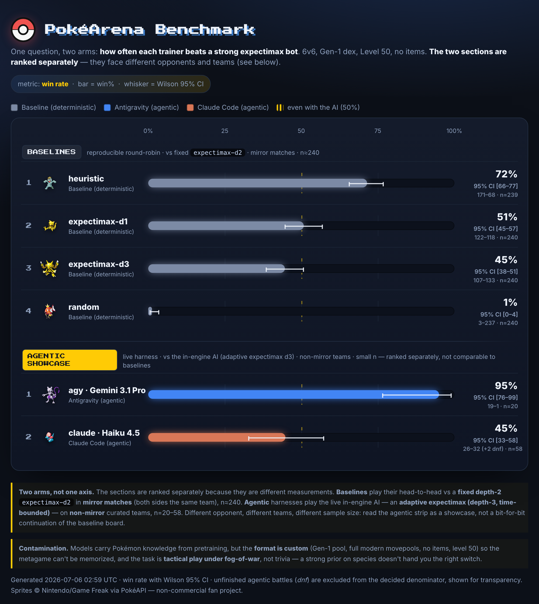

# The PokéArena Benchmark Board

One question — **how often each trainer beats a strong expectimax bot** — asked
of two different populations, and answered in **two separately-ranked sections**.
Sorted best to worst, colored by the harness that drove it: the SWE-bench layout
with a Pokédex skin.



Open the interactive version: [**benchmark-board.html**](benchmark-board.html)
(standalone, script-free; needs only a web font + the PokéAPI sprite CDN).

## Why two sections, not one ranking

Every bar is a **win rate** with a **Wilson 95% CI** whisker. But the two arms are
**not the same measurement**, so they are ranked separately and must not be read
as one leaderboard:

| | **Baselines** | **Agentic showcase** |
|---|---|---|
| who | deterministic agents (search / heuristic / random) | a live model driving the battle over MCP |
| opponent | **fixed** `expectimax-d2` | the in-engine AI — **adaptive** expectimax (depth-3, time-bounded) |
| teams | **mirror** (both sides the identical team) | **non-mirror** curated `ai-teams.json` |
| n | ≈240 | 20–58 |
| reproducible | yes, bit-for-bit | no (live LLM, small n) — a showcase strip |

Because the opponent, the teams, *and* the sample size all differ, a 95% agentic
bar and a 72% baseline bar are not comparable. The dashed line at 50% is "even
with that section's opponent."

## This snapshot (2026-07-05)

**Baselines** — vs fixed `expectimax-d2`, mirror matches:

| # | Agent | Win rate | n |
|---|-------|----------|---|
| 1 | heuristic | 72% [66–77] | 239 |
| 2 | expectimax-d1 | 51% [45–57] | 240 |
| 3 | expectimax-d3 | 45% [38–51] | 240 |
| 4 | random | 1% [0–4] | 240 |

**Agentic showcase** — vs the adaptive in-engine AI, non-mirror teams:

| # | Harness | Model | Win rate | n |
|---|---------|-------|----------|---|
| 1 | Antigravity | Gemini 3.1 Pro (High) | 95% [76–99] | 20 |
| 2 | Claude Code | Haiku 4.5 | 45% [33–58] | 58 |

Two things the board makes obvious — read *within* a section:

- **Among baselines, more search isn't more skill.** A cheap hand-tuned
  heuristic (72%) beats fixed-depth expectimax, and *deeper* search plays
  *worse* (d1 > d3) in the mirror round-robin. (Why: the search's opponent model
  can't see the hidden bench or model foe switches — see
  [benchmark.md §6](benchmark.md).)
- **Among agentic harnesses, the driver is the variable.** Same engine, same
  adaptive opponent, same team pool — Gemini 3.1 Pro clears it ~95% of the time
  while Haiku sits at a coin flip. That gap is the harness+model, not the game.

## Honest limitations

- **The two arms face different opponents and teams.** Baselines play a fixed
  depth-2 expectimax in mirror matches; the agentic AI is an adaptive depth-3
  (time-bounded) opponent on tuned `ai-teams.json` teams. Both answer "can you
  beat a strong expectimax bot," but it is not a bit-for-bit continuation — hence
  two sections.
- **agy is Genesis-only.** Antigravity hit its daily quota after Genesis
  (19–1); Spectrum and Keystone came back 100% unfinished and are **excluded**
  (a config that decides zero battles is dropped, not booked as losses).
  Retriable when the quota resets.
- **Small agentic n.** 20 battles/team on subscription. The baselines are
  n≈240; the CIs are wide on the agentic bars by design — that width *is* the
  honesty.
- **Contamination.** Models carry Pokémon knowledge from pretraining, but the
  **format is custom** (Gen-1 pool, full modern movepools, no items, level 50)
  so the metagame can't be memorized, and the task is **tactical play under
  fog-of-war**, not trivia — a strong species prior doesn't hand you the right
  switch.

## Reproduce it

```sh
# 1. Baseline round-robin (free, deterministic) across the library
bin/bench -agents 'random,heuristic,expectimax@1,expectimax@2,expectimax@3' \
  -games 20 -runs runs -out runs/arm1-baseline.jsonl

# 2. Agentic strip (subscription; needs the stack up + MCP built)
scripts/bench/run-batch.sh claude haiku Genesis 20 5 cc-haiku-Genesis
scripts/bench/run-batch.sh agy "Gemini 3.1 Pro (High)" Genesis 20 3 agy-gemini-Genesis
#   ...repeat per team

# 3. Render the board — straight from the committed provenance in this repo
bin/bench-board -baseline docs/board-data/arm1-baseline-vs-ref.jsonl \
  -agentic docs/board-data/agentic -out docs/benchmark-board.html
```

Step 3 reproduces *this exact board* — byte-for-byte, modulo the timestamp —
from the tallies checked in under [`board-data/`](board-data/): the reference's
960 head-to-head game rows (`arm1-baseline-vs-ref.jsonl`, a slice of the full
35 MB round-robin trace) plus the agentic `results.txt` tallies. No live run
required.
