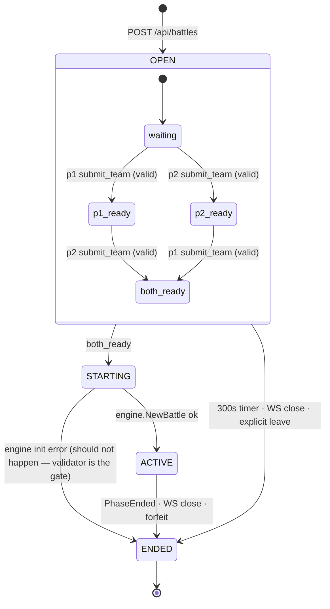

# Team picker room — pre-battle drafting phase

The picker room is the lobby that lives between "a battle has been created"
and "the engine starts ticking." It exists to let each side pick its own
team — closing the [known limitation](live-pvp.md#7-known-limitations) where
the creator picked both — without growing the engine's responsibilities.

This doc extends [`live-pvp.md`](live-pvp.md). Read that first. Everything
below assumes the claimable-slot protocol; the picker room is one new
phase grafted into its lifecycle.

---

## 1. Lifecycle

```
   ┌──────────┐                              ┌──────────────┐
   │ creator  │  POST /api/battles           │   gateway    │
   │          │  mode=live_pvp ────────────► │  mint tokens │
   │          │ ◄──── {battle_id,            │  Room: OPEN  │
   │          │        p1_url, p2_url}       │  timer: 300s │
   └──────────┘                              └──────────────┘
        │ share p2_url out-of-band
        ▼
   ┌──────────┐    WSS …/play?slot=p1&token=t1   ┌──────────┐
   │  slot 1  │ ──────────────────────────────►  │   Room   │
   │          │ ◄──── FrameRoom (you: attached)  │  (OPEN)  │
   └──────────┘                                   │          │
                                                  │          │
   ┌──────────┐    WSS …/play?slot=p2&token=t2   │          │
   │  slot 2  │ ──────────────────────────────►  │          │
   │          │ ◄──── FrameRoom (both attached)  │          │
   └──────────┘                                   └──────────┘
        │                                              │
        │  submit_team ────────────────────────────►   │
        │  ◄──── FrameRoom (you ✓, them: picking)      │
        │                                              │
        │                       ◄──── submit_team  ────│
        │  ◄──── FrameRoom (both ✓, starting…)         │
        │                                              ▼
        │                                       Room: ACTIVE
        │                                       engine.NewBattle()
        ▼                                              ▼
   each side now plays under the existing live-pvp protocol,
   under a fog-of-war filter (§6) that hides unrevealed moves.
```

The room dies, no battle is created, if **either** side fails to submit a
valid team within 300s of room creation (§7).

---

## 2. Two-tier state machine

The single most load-bearing decision: the **Room** is its own state
machine, distinct from the **Engine**. The engine never knows about
picking, timers, slot attachment, or who's connected.

```
┌───────────────────────────────────────────────────────────────┐
│  Room state — gateway, impure (timers, network, slots)        │
│                                                               │
│   OPEN ──(both submitted)──► STARTING ──► ACTIVE ──► ENDED    │
│     │                                       │                 │
│     └──(300s / cancel / leave)──────────────┴────────────►    │
│                                                               │
│  Holds: slot attachment, per-slot submitted team, timer       │
│  Owns:  the goroutine that drives transitions                 │
└────────────────────────────┬──────────────────────────────────┘
                             │ engine.NewBattle(p1, p2)
                             ▼
┌───────────────────────────────────────────────────────────────┐
│  Engine state — pure: f(state, action) → (state', events)     │
│                                                               │
│   Choosing ◄──► Replace ──► Ended                             │
│                                                               │
│  Only ticks when Room is ACTIVE. Doesn't see Room state.      │
└───────────────────────────────────────────────────────────────┘
```

The engine continues to satisfy the invariant from
[`battle-state.md`](battle-state.md): it's a pure reducer. Adding a
`PickingTeams` phase to the engine would have forced timers, slot
identity, and partial submissions into the rules layer. That layer's
test surface is `(state, action) → state'`; lobby plumbing would break
the property.

The Room *embeds* the engine state when ACTIVE; it does not extend it.

---

## 3. Room states (formal)



| State      | Lives in           | Accepts                           |
|------------|--------------------|-----------------------------------|
| `OPEN`     | gateway memory     | WS attach, `submit_team`, leave   |
| `STARTING` | gateway memory     | nothing (transient, ms)           |
| `ACTIVE`   | gateway memory     | WS `action` frames (existing)     |
| `ENDED`    | terminal           | nothing — clients disconnect      |

`ENDED` carries a `reason` field: `expired | forfeited | won_p1 | won_p2 |
draw`. The first two are new; the rest already exist.

---

## 4. Wire protocol additions

Shared shapes live alongside the existing PvP types in
[`internal/protocol/pvp.go`](../internal/protocol/pvp.go).

### Server → client: `FrameRoom`

Emitted on every Room-state change while `OPEN` (and once at transition
into `STARTING`/`ACTIVE` for unambiguity).

```json
{
  "type": "room",
  "you":  { "attached": true, "submitted": true,  "trainer": "p1" },
  "them": { "attached": true, "submitted": false, "trainer": "p2" },
  "deadline_ms": 248000,
  "phase": "open"
}
```

- `you` / `them` is from the receiving slot's perspective. The gateway
  projects per recipient — no client-side flipping.
- `deadline_ms` counts down to the room's 300s expiry. Resent on each
  state change so the client can resync a clock without a separate frame.
- `phase` is `"open" | "starting"`. `"active"` is implicit: clients
  receive a `FrameState` instead.
- Trainer name is non-strategic (matches the proposed
  `foe_trainer` fix in [`live-pvp.md` §7](live-pvp.md#7-known-limitations)).

### Client → server: `submit_team`

```json
{
  "type": "submit_team",
  "picks": [
    {
      "species": "venusaur",
      "moves":   ["sleep-powder", "leech-seed", "giga-drain", "sludge-bomb"]
    },
    { "...": "6 entries total" }
  ]
}
```

- `species` and each `moves[i]` are IDs from the dex — same vocabulary as
  `data/pokedex.json` / `data/moves.json`. Names are not accepted.
- `moves[]` length is 1–4. No duplicates within a slot.
- Server validates against the rules in §5. On failure: existing
  `FrameError` with the precise reason (illegal-move IDs are *not*
  load-bearing for security — the client knows them already from
  `/api/pokemon` — so the error can name them).
- On success: per-slot `submitted` flips to true, `FrameRoom` broadcasts
  to both, **the submission is irreversible** (no `withdraw_team`).

### Client → server: `leave_room` (optional convenience)

```json
{ "type": "leave_room" }
```

Equivalent to closing the WS. Explicit form exists so MCP / scripted
clients can signal intent without faking a TCP error. Behavior: same as
WS close — Room → `ENDED(forfeited)` if the leaver hasn't submitted, or
the room continues into ACTIVE/forfeit handling under the existing
rules if they had.

---

## 5. Team validation

A single pure function — the gate that decides whether a `submit_team`
is accepted.

```
validateTeam(picks []TeamPick, dex *domain.Dex) (TeamError | nil)
```

Rules, in order. First failure short-circuits.

1. **Slot count** — exactly 6 picks.
2. **Species exists** — `dex.Species[pick.SpeciesID]` resolves.
3. **Species Clause** — no duplicate species across the 6 picks.
4. **Move count per slot** — 1 ≤ `len(moves)` ≤ 4.
5. **No duplicate moves within a slot.**
6. **Move exists** — `dex.Moves[moveID]` resolves.
7. **Legal learnset** — every `moveID` is in `dex.Species[s].Moves`.
8. **Ability** — omitted, or one of that species' declared abilities.
9. **Item** — omitted, or present in the curated catalog (`dex.Items`).
10. **Spread** — EVs 0–252 per stat and 510 in total; IVs 0–31 per stat;
    nature omitted or present in `dex.Natures`. All three fields are
    optional and absent means the default (no EVs, perfect IVs, neutral).

Tier and format bans remain deferred — they're out of scope upstream.

The optional fields are additive on the wire, so a client that predates any
of them keeps submitting valid teams:

```json
{
  "dex_no": 143,
  "moves": ["body-slam", "earthquake", "crunch", "rest"],
  "ability": "thick-fat",
  "item": "leftovers",
  "nature": "adamant",
  "evs": { "hp": 252, "atk": 252, "def": 6, "spatk": 0, "spdef": 0, "speed": 0 },
  "ivs": { "hp": 31, "atk": 31, "def": 31, "spatk": 31, "spdef": 31, "speed": 0 }
}
```

`evs` and `ivs` use `domain.Stats` keys — `hp/atk/def/spatk/spdef/speed` — which
are *not* the same vocabulary a move's `boosts` block uses. See
[`battle-state.md`](battle-state.md#derived-stats-and-the-training-spread).

### Where it lives

[`internal/engine/team_validation.go`](../internal/engine/team_validation.go)
(new). It's a pure function over `(picks, *domain.Dex)`; the engine
package is its natural home, alongside `damage.go` and `turn.go`. The
Room calls it from the gateway; the SPA reimplements it in JS for
preview (greying out illegal moves as the user picks). The Go version
is the authority.

### Why mirror it in JS

A WS round-trip per click is heavy and feels laggy. The SPA already
ships the full dex from `/api/pokemon`. The JS copy is best-effort UX
preview; the server is the bouncer. Drift is bounded by the test
[`TestTeamValidation_MatchesJSReference`](../internal/engine/team_validation_test.go)
(future) that feeds the same fixtures to both.

---

## 6. Fog-of-war projection

The engine emits the **full** `BattleState`. The wire only ever sees a
**projection** of it, filtered for the viewing side. The projection is a
pure function, sits between engine and protocol, and is the only thing
the protocol is allowed to call.

```
engine.BattleState (full) ──► project(state, viewer, log) ──► BattleView (wire)
                                       │
                                       └── reads the action log to derive
                                           which opponent species & moves
                                           have been revealed so far
```

### Rules

For the **viewer's own side**: nothing is hidden. They see their full
team, all moves, all PP, all HP numbers, all status.

For the **opponent's side**:

| Field             | Visible?                                                  |
|-------------------|-----------------------------------------------------------|
| Species (active)  | Yes, once it has switched in this battle                  |
| Species (bench)   | No, until it switches in                                  |
| Level             | Yes, alongside species reveal                             |
| Moves             | Only individual moves that have been *used* by that mon   |
| HP                | Percentage (rounded), never exact numbers                 |
| Status condition  | Yes — they have on-field animations in real Pokémon       |
| Stat stages       | Yes — same reason                                         |
| Volatile flags    | Confusion / flinch visible, internal counters not         |
| PP per move       | Visible only for revealed moves                           |
| Items             | N/A (not modeled yet)                                     |

### The reveal accumulator

Two derivations, neither requires modifying the engine.

- **Moves** — PP delta. A foe's `move.pp < move.maxPP` means it has
  been used; reveal it. PP is already first-class state on the
  `Pokemon` struct; the projection just reads it. O(1) per move.
- **Species** — a `revealedSpecies [2]map[string]bool` set held on the
  Room, *not* the engine. Seeded at battle start with each side's lead
  (slot 0). The Room observes every switch action it shuttles to
  `engine.ResolveTurn` and writes the incoming species into the set.
  The projection reads it.

Why this split: the engine logs switches as human-readable lines, not
structured events. Rather than grow the event surface for one
consumer, the Room — which already sees every action — owns the
species accumulator. Moves don't need this because PP carries the
signal natively.

Why on the Room and not the engine: same principle as §2.
Orchestration-layer concerns stay in the Room; the engine stays pure.
"What has the viewer seen" is a viewer-side fact, not a
rules-of-Pokémon fact.

### Where it lives

[`internal/engine/view.go`](../internal/engine/view.go) — the existing
view builder, refactored from "always full" to "filtered by side." The
old `ai.View` type stays as the *internal* battle view (used by the
expectimax AI, which needs full information to make decisions); a new
public `BattleView` is the redacted wire shape.

### Trust boundary

The client receives only the projection. **Never** ship the full state
to the wire, not even briefly, not even to debug. The projection is the
trust boundary; treat it like a SQL parameterizer.

---

## 7. The 300s timer

One timer, started at room creation. Kills the room if it fires before
both sides have submitted valid teams.

```
t=0       Room created (POST /api/battles)
t=?       Slot 1 attaches (any time before t=300)
t=?       Slot 2 attaches (any time before t=300)
t=?       Slot 1 submit_team (valid)
t=?       Slot 2 submit_team (valid)   ◄── if before t=300: STARTING → ACTIVE
t=300     If still OPEN: Room → ENDED(expired); no battle is created
```

**No separate unclaimed-slot reaper.** The 300s covers everything: an
abandoned URL, a slow picker, a player who attaches and stalls. One
deadline, one death cause.

**Edge — late arrival.** If slot 2 attaches at t=290s with 10s left,
they get a cramped UI. They will probably fail. The room dies, the
creator gets `FrameError(expired)`, and recreates. We accept this for
v1; if it becomes common, switch to a deadline that resets on second
attach.

**Timer ownership.** A single `time.AfterFunc` registered when the Room
is constructed. Canceled on transition out of `OPEN`. The Room
goroutine selects on `timer.C` alongside the slot channels — no
separate watcher.

---

## 8. AI opponent

When the create request specifies an AI opponent (`mode=live`), the
gateway constructs the Room exactly as for PvP, then **immediately
auto-submits a team into slot 2** on the AI's behalf before returning.
From the human's perspective:

```
POST /api/battles {mode: "live"}
 ──► response: {battle_id, p1_url}     // no p2_url — AI holds slot 2
 ──► attach p1_url
 ──► FrameRoom: them.attached=true, them.submitted=true  // AI already ready
 ──► pick team, submit_team
 ──► STARTING → ACTIVE
```

### Team pool

A small curated set (~3–5 teams). Concretely a file:

```
data/ai-teams.json
{
  "teams": [ { name, species: [...] }, ... ]
}
```

Loaded at boot via the existing `domain.LoadDex` plumbing. The same
team validator (§5) runs over each entry at load time — illegal teams
fail loading, same as illegal moves do today.

### Why curate vs random

Random legal teams are *bad* teams: no synergy, no role coverage. A
curated pool sets a calibratable floor for the opponent's strength. ~3–5
teams is enough variety to prevent pattern-memorizing without becoming a
maintenance burden. Picks: `rand.Intn(len(pool))` at submit time.

### What does *not* change

Same Room state machine. Same engine. Same projection. Same MCP tools.
The AI path is "PvP with one side pre-filled by server code"; it has no
private code path.

---

## 9. Concurrency model

The Room is a single owning goroutine with a `select` over:

- `attachCh[2]` — slot attached (raised by WS handler).
- `clientCh[2]` — incoming `{submit_team | action | leave_room}` from
  each slot.
- `timer.C` — 300s deadline.
- `ctx.Done()` — shutdown.

All Room state mutation happens on this goroutine. Slot WS handlers are
**shuttles**: read JSON → push to `clientCh`, read from `updatesCh` →
write JSON. No mutex needed; the channel select is the lock.

This is the `livebattle.Match` coordinator pattern from
[`internal/livebattle`](../internal/livebattle), extended with two new
message types and one phase. (It was historically the in-gateway
`pvpMatch`; it now runs in the `battle-session` tier — see
[live-pvp.md §6](live-pvp.md).)

### Why not split into two goroutines (Room vs Battle)

The state transition `OPEN → ACTIVE` is the only handoff. Splitting
would require synchronizing the engine handoff across two goroutines —
same logical machine, twice the surface. One goroutine, one phase
variable, simpler.

---

## 10. MCP surface

Existing tools (unchanged signatures):

- `view(handle)` — now returns the same `BattleView` projection (§6)
  during ACTIVE, and a `{phase: "open", you, them, deadline_ms}` shape
  during OPEN.
- `act(handle, kind, index)` — unchanged; rejected with a clear error
  if the Room is not ACTIVE.

New tool:

- `submit_team(handle, picks)` — same shape as the WS message. Returns
  the updated room view. Rejected if the Room is not OPEN.

There is no `find_battle`, no `create_battle` MCP tool in v1 — Claude
Code reuses the existing `join_battle(battle_id, slot, token)` flow.
Creation still goes through `POST /api/battles` (a human, the SPA, or
an out-of-band script does it). Adding a `create_battle` tool would
mean designing for AI-initiated matchmaking, which is out of scope.

---

## 11. SPA surface (UX skeleton)

Three screens, all reachable from the existing battle URL:

1. **Builder** — invoked when the room enters `OPEN` and `you.submitted`
   is false. Sequence: pick 6 species → pick 1–4 moves each (greyed out
   when illegal, live-validated against rules §5) → "Ready". Disabled
   if any rule fails. A **"Randomize"** button (preserved from
   `web/app.js`'s existing `randomizeTeam`) fills the form with random
   legal picks in one click — the user can submit as-is or edit. The
   randomizer is purely a UI convenience: the wire payload it produces
   is an ordinary `submit_team`, indistinguishable from a hand-picked
   one.
2. **Waiting room** — `you.submitted=true`, `them.submitted=false`.
   Shows a check on your side, a spinner on the opponent's side, the
   remaining timer.
3. **Battle** — existing UI, fed by the projection (§6).

Transitions are driven by `FrameRoom` and `FrameState`; the SPA has no
local state machine of its own. Source of truth = server frames.

---

## 12. Explicitly out of scope for v1

Saying these out loud so they don't slip in:

- **Saved team library.** No identity → no library. Teams live only
  inside a Room. Clients persist locally if they want (browser
  localStorage, `pokearena-agent` filesystem). See the team-builder
  discussion thread for the reasoning.
- **Matchmaking queue.** Rooms are URL-share only for v1. Queue can be
  added later as a different way of populating slot 2; the picker
  phase is the same.
- **Reconnect during OPEN.** Same posture as ACTIVE today (see
  [`live-pvp.md` §7](live-pvp.md#7-known-limitations)) — disconnect
  aborts. Tracked together with battle-side reconnect.
- **Items, EVs, IVs, tier bans.** Out of scope upstream; nothing to
  validate.
- **Spectators.** Room has exactly two seats; no observer slot.
- **Per-slot pick timer.** One room timer covers everything. If we add
  per-side urgency later it goes in alongside, not in place of, the
  room deadline.

---

## 13. Source pointers (planned)

| Concern                         | Lives in (new = new file)                                                |
|---------------------------------|--------------------------------------------------------------------------|
| `PhasePickingTeams` removed — Room owns it | n/a (engine unchanged)                                       |
| Room state, timer, transitions  | [`internal/httpapi/pvp.go`](../internal/httpapi/pvp.go) (extended)       |
| `FrameRoom`, `submit_team` wire types | [`internal/protocol/pvp.go`](../internal/protocol/pvp.go) (extended) |
| Team validator                  | `internal/engine/team_validation.go` *(new)*                             |
| AI team pool                    | `data/ai-teams.json` *(new)* + loader in `internal/domain/dex.go`        |
| Fog-of-war view projection      | [`internal/engine/view.go`](../internal/engine/view.go) (refactored)     |
| MCP `submit_team`               | [`internal/mcpserver/tools.go`](../internal/mcpserver/tools.go) (extended) |
| SPA builder + room UI           | `web/app.js` (extended), `web/builder.html` *(new partial)*              |
| End-to-end smoke (raw WS, both submit) | [`cmd/pvp-smoke/main.go`](../cmd/pvp-smoke/main.go) (extended)    |

---

## 14. Implementation

Shipped as a single PR. Each layer (validator → protocol → projection →
Room → AI pool → SPA → MCP → smoke) is its own commit on the branch so
review can follow the dependency order. The branch's `git log` is the
authoritative sequence; this section is intentionally short.
